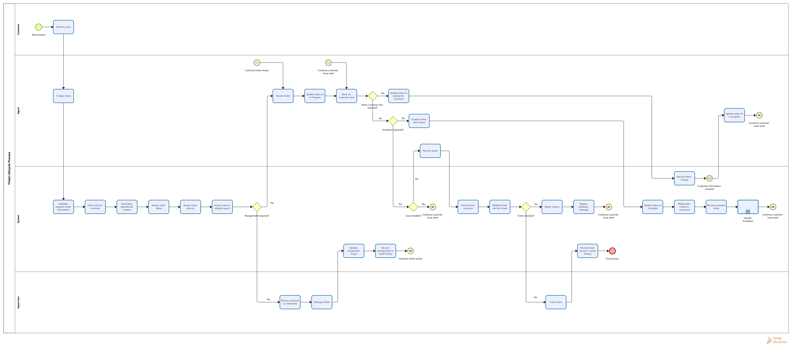
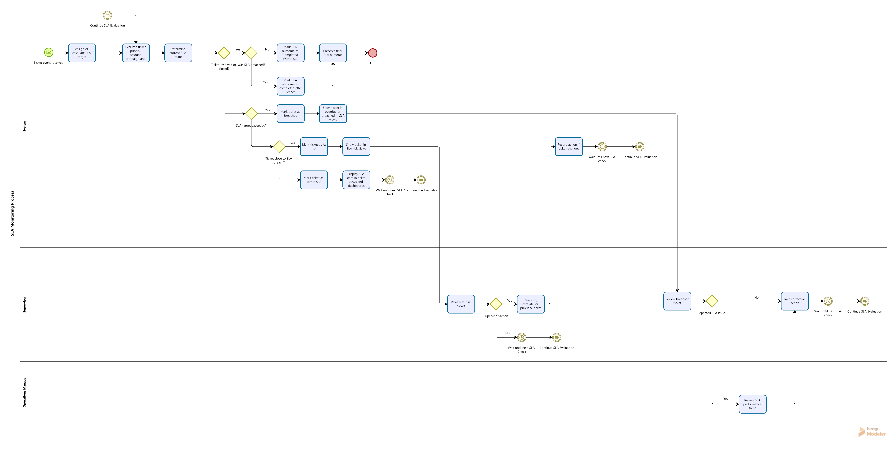
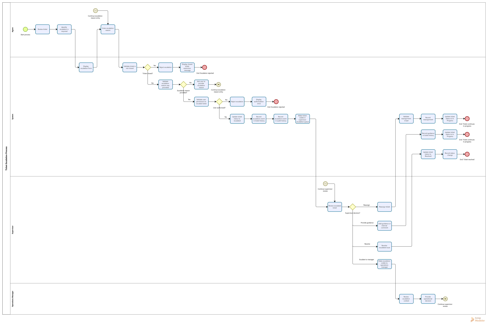
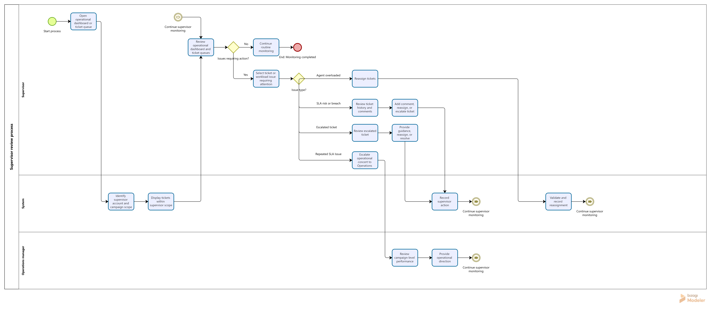
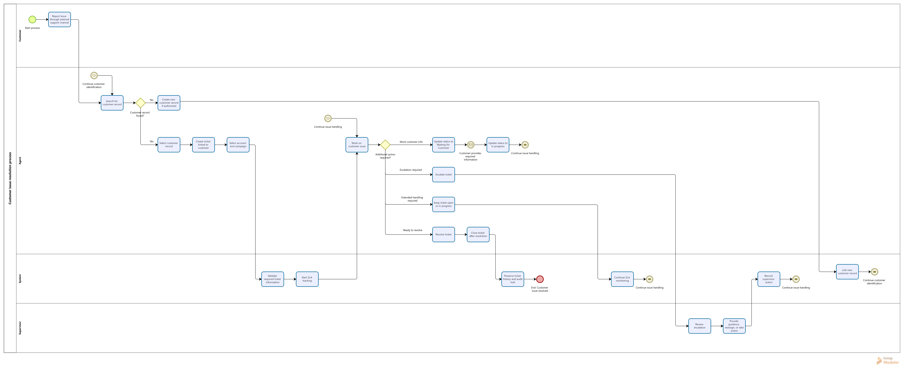
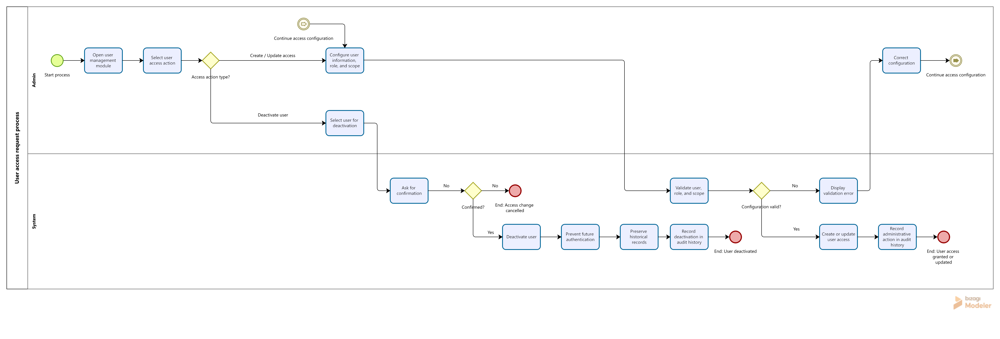

# Business Process Flows

## Document Information

| Field | Value |
|---|---|
| Project | OpsSphere |
| Document | Business Process Flows |
| File | `docs/08-business-process-flows.md` |
| Version | 1.0 |
| Status | Draft |
| Project Type | Enterprise Support Operations Platform |
| Business Context | Multinational BPO / Contact Center Operations |
| Related Diagram Folder | `docs/diagrams/bizagi/` |

---

## 1. Purpose

This document defines the initial business process flows for OpsSphere.

The purpose of this document is to describe how the main operational workflows behave from a business perspective before they are translated into software entities, APIs, database tables, frontend screens, and automated tests.

OpsSphere is not intended to be a generic CRUD application. It is an enterprise operations platform that connects support workflows, organizational structure, ticket ownership, SLA monitoring, escalation handling, supervisor oversight, user access control, auditability, and reporting-ready operational data.

This document provides the process foundation for:

- Business process modeling.
- Bizagi diagrams.
- Use case validation.
- Domain modeling.
- Workflow implementation.
- Authorization design.
- SLA behavior.
- Audit trail requirements.
- Acceptance criteria.
- Future UML and architecture diagrams.

---

## 2. Scope

This document covers the initial business process flows for the MVP version of OpsSphere.

The initial process flows are:

| Process ID | Process Name | Diagram File |
|---|---|---|
| BP-001 | Ticket Lifecycle Process | `docs/diagrams/bizagi/ticket-lifecycle-process.png` |
| BP-002 | SLA Monitoring Process | `docs/diagrams/bizagi/sla-monitoring-process.png` |
| BP-003 | Ticket Escalation Process | `docs/diagrams/bizagi/escalation-process.png` |
| BP-004 | Supervisor Review Process | `docs/diagrams/bizagi/supervisor-review-process.png` |
| BP-005 | Customer Issue Resolution Process | `docs/diagrams/bizagi/customer-issue-resolution-process.png` |
| BP-006 | User Access Request Process | `docs/diagrams/bizagi/user-access-request-process.png` |

---

## 3. Diagram Folder Structure

Bizagi process diagrams should be stored under the following folder:

```text
docs/
  diagrams/
    bizagi/
      ticket-lifecycle-process.png
      sla-monitoring-process.png
      escalation-process.png
      supervisor-review-process.png
      customer-issue-resolution-process.png
      user-access-request-process.png
```

The Markdown document references those images using relative paths.

Example:

```markdown

```

Because this Markdown file is located at:

```text
docs/08-business-process-flows.md
```

The relative image path:

```text
diagrams/bizagi/ticket-lifecycle-process.png
```

points to:

```text
docs/diagrams/bizagi/ticket-lifecycle-process.png
```

---

## 4. Process Modeling Notation

The process diagrams may be created using Bizagi Modeler.

Recommended diagram conventions:

- Use swimlanes for actors or departments.
- Use clear start and end events.
- Use gateways for business decisions.
- Use task names written as business actions.
- Use intermediate events for SLA monitoring, waiting states, or escalation triggers.
- Keep diagrams readable enough to be understood by both technical and non-technical stakeholders.

Recommended swimlanes:

- Customer
- Agent
- Supervisor
- Operations Manager
- Admin
- System

Not every process requires every swimlane.

---

# BP-001: Ticket Lifecycle Process

## Description

This process represents the end-to-end lifecycle of a support ticket from creation to closure.

It starts when a customer issue is received and ends when the ticket is closed after resolution. The process includes ticket creation, assignment, work execution, status updates, internal comments, SLA monitoring, escalation when needed, resolution, closure, and audit history.

## Related Diagram


> Diagram placeholder: export the Bizagi diagram as `ticket-lifecycle-process.png` and store it in `docs/diagrams/bizagi/`.

## Primary Actors

- Agent
- Supervisor
- System
- Customer

## Supporting Actors

- Operations Manager
- Viewer

## Trigger

A customer issue, request, or support case needs to be recorded and handled by the operation.

## Main Flow

1. Customer issue is received by the support operation.
2. Agent creates a new ticket.
3. System validates required ticket information.
4. System links the ticket to the customer.
5. System associates the ticket with region, country, account, and campaign context.
6. System assigns initial status.
7. System assigns initial priority.
8. System starts SLA tracking.
9. Ticket is assigned to an eligible agent.
10. Agent reviews the ticket.
11. Agent updates ticket status to `In Progress`.
12. Agent works on the customer issue.
13. Agent adds internal comments when needed.
14. System records important changes in audit history.
15. Agent resolves the ticket when the issue is handled.
16. System preserves SLA outcome.
17. Agent or Supervisor closes the resolved ticket.
18. System records ticket closure in audit history.

## Alternative Flows

### AF-001: Ticket Requires Reassignment

1. Supervisor reviews workload or ownership.
2. Supervisor identifies that the ticket should be handled by another agent.
3. Supervisor reassigns the ticket to an eligible agent.
4. System validates assignment scope.
5. System records reassignment in audit history.
6. Ticket continues through the lifecycle.

### AF-002: Ticket Requires Escalation

1. Agent identifies that the ticket requires higher-level attention.
2. Agent escalates the ticket with an escalation reason.
3. System changes the ticket status to `Escalated`.
4. System makes the ticket visible to the supervisor.
5. Supervisor reviews the escalated ticket.
6. Ticket continues through the escalation process.

### AF-003: Ticket Is Waiting for Customer

1. Agent requires additional information from the customer.
2. Agent updates the ticket status to `Waiting for Customer`.
3. System records the status change.
4. Customer information is received.
5. Agent updates the ticket back to `In Progress`.
6. Ticket continues through the lifecycle.

### AF-004: Ticket Cannot Be Closed

1. User attempts to close a ticket that is not resolved.
2. System rejects the closure.
3. System displays a validation message.
4. Ticket remains open, assigned, in progress, waiting, or escalated.

## Business Rules

- A ticket must be linked to a customer.
- A ticket must be linked to an account and campaign.
- A ticket must have a status.
- A ticket must have a priority.
- SLA tracking starts when the ticket is created.
- Ticket status changes must follow valid workflow transitions.
- A ticket must be resolved before it can be closed.
- Closed tickets cannot be edited unless reopened by an authorized supervisor or Admin.
- Critical ticket changes must be recorded in audit history.

## Outputs

- Created ticket.
- Assigned ticket owner.
- Updated ticket status.
- SLA state.
- Internal comments.
- Ticket history.
- Audit records.
- Final resolution.
- Closed ticket.

## Process Success Criteria

- Ticket can be traced from creation to closure.
- Ticket ownership is clear.
- SLA state is visible.
- Supervisor can intervene when needed.
- Resolution and closure are recorded.
- Audit history captures critical changes.

---

# BP-002: SLA Monitoring Process

## Description

This process represents how OpsSphere monitors SLA status for active tickets.

The process helps agents, supervisors, managers, and viewers identify tickets that are within SLA, at risk, breached, or completed.

## Related Diagram



> Diagram placeholder: export the Bizagi diagram as `sla-monitoring-process.png` and store it in `docs/diagrams/bizagi/`.

## Primary Actors

- System
- Agent
- Supervisor

## Supporting Actors

- Operations Manager
- Viewer

## Trigger

A ticket is created or updated, and the system needs to evaluate its SLA state.

## Main Flow

1. Ticket is created.
2. System assigns or calculates the SLA target.
3. System starts SLA tracking from ticket creation time.
4. System evaluates the ticket priority, account, campaign, and status.
5. System determines the current SLA state.
6. System marks the ticket as `Within SLA`, `At Risk`, `Breached`, or `Completed`.
7. Agent sees SLA state in ticket views.
8. Supervisor sees SLA state in ticket queues and dashboards.
9. Operations Manager sees SLA trends in dashboards.
10. System preserves final SLA outcome when the ticket is resolved or closed.

## Alternative Flows

### AF-001: Ticket Approaches SLA Breach

1. System detects that the ticket is close to the SLA target.
2. System marks the ticket as `At Risk`.
3. Ticket appears in SLA risk views.
4. Supervisor reviews the ticket.
5. Supervisor may reassign, escalate, or prioritize the ticket.

### AF-002: Ticket Breaches SLA

1. System detects that the ticket exceeded its SLA target.
2. System marks the ticket as `Breached`.
3. Ticket appears in overdue or breached SLA views.
4. Supervisor reviews the ticket.
5. Operations Manager may review SLA performance if the issue repeats.

### AF-003: Ticket Is Resolved Within SLA

1. Agent resolves the ticket before SLA breach.
2. System marks the SLA outcome as completed within SLA.
3. System preserves the final SLA outcome.
4. Ticket can proceed to closure.

### AF-004: Ticket Is Resolved After Breach

1. Agent resolves the ticket after SLA breach.
2. System marks the SLA outcome as completed after breach.
3. System preserves the final SLA outcome.
4. Ticket can proceed to closure.

## Business Rules

- Each ticket must have an SLA target.
- SLA timers start when the ticket is created.
- SLA state must be visible to authorized users.
- Tickets approaching breach should be marked as `At Risk`.
- Tickets exceeding the SLA target must be marked as `Breached`.
- Completed tickets should preserve their final SLA outcome.
- SLA dashboard data must respect role and operational scope.

## Outputs

- SLA target.
- SLA state.
- At-risk ticket visibility.
- Breached ticket visibility.
- SLA dashboard data.
- Final SLA outcome.

## Process Success Criteria

- At-risk tickets can be identified before breach.
- Breached tickets are visible to supervisors.
- SLA state is available in ticket views and dashboards.
- Final SLA outcome is preserved after resolution or closure.
- SLA visibility respects user role and scope.

---

# BP-003: Ticket Escalation Process

## Description

This process represents how a ticket is escalated when it requires higher-level attention.

Escalation helps ensure that tickets with higher risk, blocked progress, complex issues, customer impact, or SLA risk are visible to supervisors and managers.

This process starts when an agent identifies that a ticket requires escalation and ends when the escalation is rejected, the ticket returns to active progress, or the escalated issue is resolved.

## Related Diagram



> Diagram placeholder: export the Bizagi diagram as `escalation-process.png` and store it in `docs/diagrams/bizagi/`.

## Primary Actors

- Agent
- Supervisor
- System

## Supporting Actors

- Operations Manager

## Trigger

An agent or supervisor identifies that a ticket requires higher-level attention.

## BPMN Modeling Notes

This process uses Link Events to keep the Bizagi diagram readable and avoid long sequence flows.

The following Link Events are used:

- `Continue Escalation Reason Entry`
- `Continue Supervisor Review`

`Continue Escalation Reason Entry` is used when the escalation reason is missing and the process must return to the reason entry step.

`Continue Supervisor Review` is used when the escalation is sent to an Operations Manager and then returns to the supervisor review stage.

## Main Flow

1. Agent reviews the ticket.
2. Agent identifies that escalation is required.
3. Agent selects the escalation action.
4. System displays the escalation form.
5. Link Catch Event: `Continue Escalation Reason Entry`.
6. Agent enters the escalation reason.
7. System validates that the ticket is not closed.
8. System validates that an escalation reason was provided.
9. System validates that the user has permission to escalate the ticket.
10. System updates the ticket status to `Escalated`.
11. System records the escalation event in ticket history.
12. System records the escalation event in audit history.
13. System makes the ticket visible in the supervisor escalation queue.
14. Link Catch Event: `Continue Supervisor Review`.
15. Supervisor reviews the escalated ticket.
16. Supervisor decides the next action.
17. The process continues according to the supervisor decision.

## Alternative Flows

### AF-001: Missing Escalation Reason

1. User attempts to escalate the ticket without a reason.
2. System detects that the escalation reason was not provided.
3. System asks the user to provide an escalation reason.
4. Link Throw Event: `Continue Escalation Reason Entry`.
5. User returns to the escalation reason entry step.
6. Process continues with escalation validation.

### AF-002: Closed Ticket Escalation Attempt

1. User attempts to escalate a closed ticket.
2. System detects that the ticket is closed.
3. System rejects the escalation.
4. System displays a closed ticket restriction message.
5. Process ends with `Escalation rejected`.

### AF-003: Unauthorized Escalation Attempt

1. User attempts to escalate a ticket without proper permission.
2. System detects that the user is not authorized to escalate the ticket.
3. System rejects the escalation.
4. System displays an authorization error.
5. Process ends with `Escalation rejected`.

### AF-004: Supervisor Reassigns Ticket

1. Supervisor reviews the escalated ticket.
2. Supervisor decides to reassign the ticket.
3. Supervisor reassigns the ticket.
4. System validates assignment scope.
5. System records the reassignment.
6. System updates the ticket status to `In Progress`.
7. Process ends with `Ticket continues in progress`.

### AF-005: Supervisor Provides Guidance

1. Supervisor reviews the escalated ticket.
2. Supervisor decides to provide guidance instead of reassigning or resolving the ticket.
3. Supervisor adds guidance or an internal comment.
4. System records the guidance in ticket history.
5. System updates the ticket status to `In Progress`.
6. Process ends with `Ticket continues in progress`.

### AF-006: Supervisor Resolves Escalation

1. Supervisor reviews the escalated ticket.
2. Supervisor decides that the escalated issue can be resolved.
3. Supervisor resolves the escalated issue.
4. System updates the ticket status to `Resolved`.
5. System records the status change.
6. Process ends with `Ticket resolved`.

### AF-007: Escalation Sent to Operations Manager

1. Supervisor reviews the escalated ticket.
2. Supervisor decides that the escalation requires Operations Manager visibility.
3. System makes the escalation visible to the Operations Manager.
4. Operations Manager reviews the escalation context.
5. Operations Manager provides an operational decision.
6. Link Throw Event: `Continue Supervisor Review`.
7. Process returns to the supervisor review stage.

## Business Rules

- Escalated tickets must include an escalation reason.
- Closed tickets cannot be escalated.
- Users may only escalate tickets within their operational scope.
- Users must have permission to escalate a ticket.
- Escalated tickets must be visible in the supervisor escalation queue.
- Escalated tickets should be visible to authorized managers within scope when manager review is required.
- Escalation events must be recorded in ticket history.
- Escalation events must be recorded in audit history.
- Reassignments from escalation must validate assignment scope.
- Supervisor guidance or comments must be recorded in ticket history.
- Status changes caused by escalation decisions must be recorded.

## Outputs

- Escalated ticket.
- Escalation reason.
- Supervisor escalation queue visibility.
- Optional Operations Manager visibility.
- Ticket history record.
- Audit history record.
- Supervisor decision.
- Reassignment record when applicable.
- Status change record when applicable.
- Final escalation outcome.

## End States

This process may end in one of the following states:

| End State | Description |
|---|---|
| Escalation rejected | The escalation is rejected because the ticket is closed or the user is not authorized. |
| Ticket continues in progress | The supervisor reassigns the ticket, provides guidance, or returns it to active work. |
| Ticket resolved | The supervisor resolves the escalated issue and the ticket moves to `Resolved`. |

## Process Success Criteria

- Escalations are visible to supervisors.
- Escalation reasons are captured.
- Missing escalation reasons return to the reason entry step using a Link Event.
- Closed tickets cannot be escalated.
- Unauthorized escalation attempts are rejected.
- Escalation events are recorded in ticket history.
- Escalation events are recorded in audit history.
- Supervisors can reassign, guide, resolve, or escalate to Operations Manager.
- Operations Manager review can return the process to supervisor review using a Link Event.
- Supervisor decisions result in a clear process end state.

---

# BP-004: Supervisor Review Process

## Description

This process represents how supervisors review operational workload, ticket progress, SLA risk, escalations, and agent performance within their assigned account or campaign scope.

Supervisor review is important because the supervisor acts as the operational control point between agents and managers.

This process is modeled as a supervisor review session. The supervisor reviews scoped operational data, identifies issues that require action, takes the appropriate action, and then returns to monitoring until no critical issues remain.

## Related Diagram



> Diagram placeholder: export the Bizagi diagram as `supervisor-review-process.png` and store it in `docs/diagrams/bizagi/`.

## Primary Actors

- Supervisor
- System

## Supporting Actors

- Agent
- Operations Manager

## Trigger

A supervisor reviews daily workload, SLA risk, escalated tickets, or team performance.

## BPMN Modeling Notes

This process uses a Link Event to keep the Bizagi diagram readable and avoid long sequence flows.

The following Link Event is used:

- `Continue Supervisor Monitoring`

`Continue Supervisor Monitoring` is used after the supervisor or system records an action and the process returns to the supervisor monitoring step.

This keeps the process focused on the supervisor review loop:

```text
Review
  → Identify issue
  → Take action
  → Record action
  → Continue monitoring
```

## Main Flow

1. Supervisor opens the operational dashboard or ticket queue.
2. System identifies the supervisor's assigned account and campaign scope.
3. System displays tickets within the supervisor's scope.
4. Link Catch Event: `Continue Supervisor Monitoring`.
5. Supervisor reviews the operational dashboard and ticket queues.
6. System displays workload, SLA risk, breached tickets, escalations, and agent distribution.
7. Supervisor determines whether there are issues requiring action.
8. If there are issues requiring action, Supervisor selects the ticket or workload issue that requires attention.
9. Supervisor identifies the issue type.
10. Supervisor takes the appropriate action based on the issue type.
11. System records the supervisor action when the action modifies ticket state or operational history.
12. Link Throw Event: `Continue Supervisor Monitoring`.
13. Supervisor continues monitoring until no critical issues require action.
14. If no critical issues are found, Supervisor continues routine monitoring.
15. Process ends with `Monitoring completed`.

## Alternative Flows

### AF-001: Agent Is Overloaded

1. Supervisor identifies that one agent has excessive workload.
2. Supervisor selects the affected ticket or workload issue.
3. Supervisor reassigns one or more tickets.
4. System validates and records the reassignment.
5. Link Throw Event: `Continue Supervisor Monitoring`.
6. Process returns to the supervisor monitoring step.

### AF-002: SLA Risk or Breach Detected

1. Supervisor identifies a ticket close to SLA breach or already breached.
2. Supervisor reviews ticket history and comments.
3. Supervisor adds an internal comment, reassigns the ticket, or escalates the ticket.
4. System records the supervisor action.
5. Link Throw Event: `Continue Supervisor Monitoring`.
6. Process returns to the supervisor monitoring step.

### AF-003: Escalated Ticket Requires Review

1. Supervisor identifies an escalated ticket.
2. Supervisor reviews the escalated ticket.
3. Supervisor provides guidance, reassigns the ticket, or resolves the escalated issue.
4. System records the supervisor decision.
5. Link Throw Event: `Continue Supervisor Monitoring`.
6. Process returns to the supervisor monitoring step.

### AF-004: Repeated SLA Issues Detected

1. Supervisor notices repeated SLA risk or breach patterns in an account or campaign.
2. Supervisor escalates the operational concern to an Operations Manager.
3. Operations Manager reviews campaign-level performance.
4. Operations Manager provides operational direction.
5. Link Throw Event: `Continue Supervisor Monitoring`.
6. Process returns to the supervisor monitoring step.

### AF-005: No Critical Issues Found

1. Supervisor reviews the dashboard and ticket queues.
2. No escalations, SLA risks, breached tickets, overload issues, or workload concerns are found.
3. Supervisor continues routine monitoring.
4. Process ends with `Monitoring completed`.

## Business Rules

- Supervisors may only review tickets within their assigned operational scope.
- Supervisor dashboard data must respect account and campaign scope.
- Supervisors must be able to identify workload distribution by agent.
- Supervisors must be able to identify tickets close to SLA breach.
- Supervisors must be able to identify breached tickets.
- Supervisors must be able to view escalated tickets.
- Supervisors may reassign tickets within their assigned scope.
- Supervisors may add internal comments when reviewing tickets.
- Supervisors may escalate tickets when higher-level attention is required.
- Supervisors may resolve escalated issues when authorized.
- Reassignments must be recorded in audit history.
- Escalations must be recorded in audit history.
- Supervisor comments, guidance, and status-changing actions must be recorded in ticket history.
- Repeated SLA issues may be escalated to an Operations Manager for campaign-level review.

## Outputs

- Reviewed operational dashboard.
- Reviewed ticket queue.
- Identified workload issues.
- Identified SLA risk or breach issues.
- Identified escalated tickets.
- Supervisor decisions.
- Reassigned tickets when needed.
- Internal comments or guidance when needed.
- Escalation actions when needed.
- Operations Manager review when repeated SLA issues are detected.
- Audit records for state-changing actions.
- Ticket history records for supervisor decisions.
- Final monitoring outcome.

## End States

This process may end in the following state:

| End State | Description |
|---|---|
| Monitoring completed | The supervisor completes the review session after no critical issues require further action. |

## Process Success Criteria

- Supervisor can see operational workload within assigned scope.
- Supervisor can identify overloaded agents.
- Supervisor can identify stuck, overdue, breached, or at-risk tickets.
- Supervisor can act on escalated tickets.
- Supervisor can reassign work when needed.
- Supervisor can add comments, guidance, or escalation actions when needed.
- Repeated SLA issues can be escalated to an Operations Manager.
- Supervisor actions are traceable.
- The process returns to monitoring after action using the `Continue Supervisor Monitoring` Link Event.
- The review session ends cleanly when no critical issues remain.

---

# BP-005: Customer Issue Resolution Process

## Description

This process represents how a customer issue is handled from the business perspective.

The customer does not directly access OpsSphere in the initial version. Instead, the customer is linked to a ticket that is handled internally by agents and supervisors.

This process focuses on how a customer issue is received, linked to a customer record, converted into a ticket, handled internally, escalated or extended when needed, and resolved with traceable ticket history.

## Related Diagram



> Diagram placeholder: export the Bizagi diagram as `customer-issue-resolution-process.png` and store it in `docs/diagrams/bizagi/`.

## Primary Actors

- Customer
- Agent
- System

## Supporting Actors

- Supervisor

## Trigger

A customer reports an issue, request, or support need through an external support channel.

## BPMN Modeling Notes

This process uses Link Events to keep the Bizagi diagram readable and avoid long sequence flows.

The following Link Events are used:

- `Continue Customer Identification`
- `Continue Issue Handling`

`Continue Customer Identification` is used when a customer record does not exist and the process must return to customer identification after the customer record is created.

`Continue Issue Handling` is used when the process returns to the active handling stage after requesting more customer information, handling an escalation, or keeping the ticket open for extended work.

This keeps the process focused on the customer issue resolution loop:

```text
Identify customer
  → Create or select customer
  → Create ticket
  → Handle issue
  → Request more information, escalate, extend handling, or resolve
```

## Main Flow

1. Customer reports an issue through an external support channel.
2. Agent receives the customer issue.
3. Link Catch Event: `Continue Customer Identification`.
4. Agent searches for the customer record.
5. System determines whether the customer record exists.
6. If the customer record exists, Agent selects the customer record.
7. Agent creates a ticket linked to the customer.
8. Agent selects the correct account and campaign.
9. System validates required ticket information.
10. System starts SLA tracking.
11. Link Catch Event: `Continue Issue Handling`.
12. Agent works on the customer issue.
13. Agent determines what additional action is required.
14. The process continues according to the required action:
    - More customer information.
    - Escalation required.
    - Extended handling required.
    - Ready to resolve.
15. If the issue is ready to resolve, Agent resolves the ticket.
16. Agent or Supervisor closes the ticket after resolution.
17. System preserves the ticket history and audit trail.
18. Process ends with `Customer issue resolved`.

## Alternative Flows

### AF-001: Customer Record Does Not Exist

1. Agent searches for the customer record.
2. System determines that no matching customer record exists.
3. Agent creates a new customer record if authorized.
4. System links the new customer record.
5. Link Throw Event: `Continue Customer Identification`.
6. Process returns to customer identification.

### AF-002: Issue Requires More Customer Information

1. Agent determines that more customer information is required.
2. Agent updates the ticket status to `Waiting for Customer`.
3. Customer provides the required information.
4. Message Intermediate Event: `Customer provides required information`.
5. Agent updates the ticket status to `In Progress`.
6. Link Throw Event: `Continue Issue Handling`.
7. Process returns to active issue handling.

### AF-003: Issue Requires Escalation

1. Agent determines that the issue cannot be resolved at the current level.
2. Agent escalates the ticket.
3. Supervisor reviews the escalation.
4. Supervisor provides guidance, reassigns, or takes action.
5. System records the supervisor action.
6. Link Throw Event: `Continue Issue Handling`.
7. Process returns to active issue handling.

### AF-004: Issue Requires Extended Handling

1. Agent determines that the issue cannot be resolved immediately.
2. Agent keeps the ticket open or in progress.
3. System continues SLA monitoring.
4. Link Throw Event: `Continue Issue Handling`.
5. Process returns to active issue handling.

### AF-005: Issue Is Ready to Resolve

1. Agent determines that the customer issue has been handled.
2. Agent resolves the ticket.
3. Agent or Supervisor closes the ticket after resolution.
4. System preserves the ticket history and audit trail.
5. Process ends with `Customer issue resolved`.

## Business Rules

- Customer does not directly access OpsSphere in the initial version.
- A ticket must be linked to a customer.
- A ticket must be linked to an account and campaign.
- Required ticket information must be validated before SLA tracking starts.
- Customer issue history must be visible only to authorized internal users.
- Internal comments must not be exposed to customers.
- Ticket status must reflect the current handling state.
- Tickets waiting for customer information must be marked as `Waiting for Customer`.
- Tickets returning from customer wait state must be updated to `In Progress`.
- Escalated issues must be reviewed by a Supervisor.
- Extended handling must keep SLA monitoring active.
- Resolved tickets may proceed to closure.
- Customer-related ticket activity must respect role and scope restrictions.
- Ticket history and audit trail must be preserved.

## Outputs

- Customer-linked ticket.
- Customer issue history.
- Validated ticket information.
- SLA tracking started.
- Ticket status updates.
- Internal comments when needed.
- Escalation or supervisor action when needed.
- Continued SLA monitoring for extended handling.
- Resolution information.
- Closed support case.
- Ticket history.
- Audit trail.

## End States

This process may end in the following state:

| End State | Description |
|---|---|
| Customer issue resolved | The issue has been resolved, the ticket has been closed after resolution, and ticket history and audit trail have been preserved. |

## Process Success Criteria

- Customer issue is recorded as a ticket.
- Ticket is linked to the correct customer.
- Ticket is linked to the correct account and campaign.
- Agent has enough context to work on the issue.
- Missing customer records can be created and returned to customer identification using the `Continue Customer Identification` Link Event.
- Requests for more customer information return to active issue handling using the `Continue Issue Handling` Link Event.
- Supervisor can intervene when escalation is required.
- Extended handling keeps SLA monitoring active.
- Customer issue is resolved or properly escalated.
- Ticket history remains traceable.
- Audit trail is preserved.

---

# BP-006: User Access Request Process

## Description

This process represents how user access is created, updated, scoped, or deactivated inside OpsSphere.

This process supports administrative governance by ensuring that users receive the correct role and operational scope.

The process is intentionally modeled in a simplified way. New user creation, role changes, and scope changes are grouped under a single `Create / Update Access` path because they follow the same business pattern: configure user access, validate it, apply it, and record the administrative action.

User deactivation is modeled as a separate path because it requires confirmation, prevents future authentication, preserves historical records, and records a deactivation audit event.

## Related Diagram



> Diagram placeholder: export the Bizagi diagram as `user-access-request-process.png` and store it in `docs/diagrams/bizagi/`.

## Primary Actors

- Admin
- System

## Supporting Actors

- Operations Manager
- Supervisor
- Agent
- Viewer

## Trigger

A new internal user needs access, an existing user needs an updated role or scope, or a user must be deactivated.

## BPMN Modeling Notes

This process uses a Link Event to keep the Bizagi diagram readable and avoid long sequence flows.

The following Link Event is used:

- `Continue Access Configuration`

`Continue Access Configuration` is used when the system detects an invalid user, role, or scope configuration and the Admin must correct the configuration before validation runs again.

The supporting actors are not modeled as active swimlanes because they are target user roles, not direct process performers. The active performers in this process are:

- Admin
- System

Recommended swimlanes:

```text
Admin
System
```

## Main Flow

1. Admin opens the user management module.
2. Admin selects a user access action.
3. System determines the access action type.
4. If the action type is `Create / Update Access`, the process continues through the access configuration path.
5. Link Catch Event: `Continue Access Configuration`.
6. Admin configures user information, role, and operational scope.
7. System validates the user, role, and scope configuration.
8. System determines whether the configuration is valid.
9. If the configuration is valid, System creates or updates user access.
10. System records the administrative action in audit history.
11. Process ends with `User access granted or updated`.

## Alternative Flows

### AF-001: Create / Update Access

1. Admin selects `Create / Update Access`.
2. Link Catch Event: `Continue Access Configuration`.
3. Admin configures user information, role, and operational scope.
4. System validates the user, role, and scope configuration.
5. System determines that the configuration is valid.
6. System creates or updates user access.
7. System records the administrative action in audit history.
8. Process ends with `User access granted or updated`.

### AF-002: Invalid Access Configuration

1. Admin configures user information, role, or operational scope.
2. System validates the user, role, and scope configuration.
3. System determines that the configuration is invalid.
4. System displays a validation error.
5. Admin corrects the configuration.
6. Link Throw Event: `Continue Access Configuration`.
7. Process returns to the access configuration step.

### AF-003: User Deactivation

1. Admin selects `Deactivate User`.
2. Admin selects the user for deactivation.
3. System asks for deactivation confirmation.
4. Admin confirms the deactivation.
5. System deactivates the user.
6. System prevents future authentication for the deactivated user.
7. System preserves historical records linked to the user.
8. System records the deactivation in audit history.
9. Process ends with `User deactivated`.

### AF-004: Deactivation Cancelled

1. Admin selects `Deactivate User`.
2. Admin selects the user for deactivation.
3. System asks for deactivation confirmation.
4. Admin does not confirm the deactivation.
5. Process ends with `Access change cancelled`.

## Business Rules

- Only Admin users may manage users.
- Users must have a valid role before accessing protected business modules.
- Operational users must have assigned scope.
- Role and scope must be compatible.
- Invalid user, role, or scope configuration must be rejected.
- Invalid configuration must return to the access configuration step using the `Continue Access Configuration` Link Event.
- Deactivated users cannot authenticate.
- User management changes must be recorded in audit history.
- Role changes must be recorded in audit history.
- Scope changes must be recorded in audit history.
- User deactivation must be recorded in audit history.
- User deactivation must preserve historical tickets, comments, assignments, and audit records.
- Historical records linked to a deactivated user must remain traceable.

## Outputs

- Created user access.
- Updated user access.
- Assigned role.
- Assigned operational scope.
- Deactivated user.
- Authentication blocked for deactivated user.
- Preserved historical records.
- Administrative audit record.
- Deactivation audit record.

## End States

This process may end in one of the following states:

| End State | Description |
|---|---|
| User access granted or updated | The user has been created or updated with valid role and scope configuration. |
| User deactivated | The user has been deactivated, future authentication has been blocked, and historical records have been preserved. |
| Access change cancelled | The Admin cancelled the deactivation before changes were applied. |

## Process Success Criteria

- User access reflects business responsibility.
- Users receive valid roles.
- Operational users receive valid operational scope.
- Role and scope compatibility is validated.
- Invalid access configuration can be corrected through the `Continue Access Configuration` Link Event.
- Users only see data within their role and scope.
- Deactivated users cannot access the system.
- Deactivation preserves historical records.
- Administrative changes are auditable.
- Historical records remain traceable.

---

# 5. Process-to-Use-Case Traceability

| Process | Related Use Cases |
|---|---|
| BP-001 Ticket Lifecycle Process | UC-002 Create Ticket, UC-003 Assign Ticket, UC-004 Update Ticket Status, UC-007 Resolve Ticket, UC-008 Close Ticket |
| BP-002 SLA Monitoring Process | UC-002 Create Ticket, UC-004 Update Ticket Status, UC-009 View SLA Dashboard |
| BP-003 Ticket Escalation Process | UC-006 Escalate Ticket |
| BP-004 Supervisor Review Process | UC-003 Assign Ticket, UC-006 Escalate Ticket, UC-009 View SLA Dashboard |
| BP-005 Customer Issue Resolution Process | UC-002 Create Ticket, UC-005 Add Internal Comment, UC-007 Resolve Ticket, UC-008 Close Ticket |
| BP-006 User Access Request Process | UC-001 Authenticate User, UC-010 Manage Users |

---

# 6. Process-to-Domain Traceability

| Process | Main Domain Concepts |
|---|---|
| BP-001 Ticket Lifecycle Process | Ticket, Customer, Account, Campaign, Agent, Supervisor, SLA, Priority, Status, Comment, Audit Trail, Resolution |
| BP-002 SLA Monitoring Process | Ticket, SLA, SLA State, Priority, Account, Campaign, Queue, Dashboard |
| BP-003 Ticket Escalation Process | Ticket, Escalation, Supervisor, Queue, Status, Audit Trail |
| BP-004 Supervisor Review Process | Supervisor, Agent, Queue, Ticket, SLA, Escalation, Dashboard, Audit Trail |
| BP-005 Customer Issue Resolution Process | Customer, Ticket, Agent, Comment, Resolution, Status, Audit Trail |
| BP-006 User Access Request Process | User, Role, Permission, Scope, Admin, Manager, Supervisor, Agent, Viewer, Audit Trail |

---

# 7. Diagram Creation Checklist

Use this checklist when creating each Bizagi diagram.

## 7.1 General Checklist

- Diagram has a clear start event.
- Diagram has a clear end event.
- Main actors are represented as swimlanes.
- Tasks are written as business actions.
- Decision points use gateways.
- Alternative paths are visible.
- System validations are represented.
- Audit points are represented when relevant.
- SLA or escalation triggers are represented when relevant.
- Diagram filename matches the Markdown reference.

## 7.2 Required Diagram Files

| Diagram | Required File |
|---|---|
| Ticket Lifecycle Process | `docs/diagrams/bizagi/ticket-lifecycle-process.png` |
| SLA Monitoring Process | `docs/diagrams/bizagi/sla-monitoring-process.png` |
| Ticket Escalation Process | `docs/diagrams/bizagi/escalation-process.png` |
| Supervisor Review Process | `docs/diagrams/bizagi/supervisor-review-process.png` |
| Customer Issue Resolution Process | `docs/diagrams/bizagi/customer-issue-resolution-process.png` |
| User Access Request Process | `docs/diagrams/bizagi/user-access-request-process.png` |

---

# 8. GitHub Rendering Notes

Markdown image syntax:

```markdown

```

Example used in this document:

```markdown

```

Recommended image formats:

- `.png` for exported Bizagi diagrams.
- `.svg` if the diagram tool supports clean vector export.
- `.jpg` only if file size becomes an issue.

Recommended naming style:

- Use lowercase.
- Use hyphens between words.
- Avoid spaces.
- Avoid special characters.

Good:

```text
ticket-lifecycle-process.png
```

Avoid:

```text
Ticket Lifecycle Process Final Version 2.png
```

---

# 9. Document Summary

This document defines the initial business process flows for OpsSphere.

The process flows describe how tickets move through the system, how SLA monitoring works, how escalations are handled, how supervisors review operational work, how customer issues are resolved, and how user access is managed.

The Bizagi diagrams referenced in this document should be stored separately under:

```text
docs/diagrams/bizagi/
```

This allows GitHub to render the process diagrams directly inside the Markdown document while keeping the diagram image files reusable for presentations, PDFs, and future documentation.