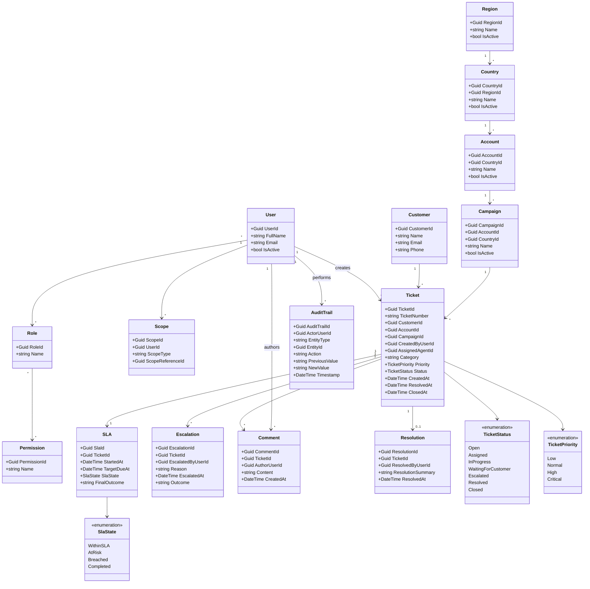

# Domain Model

## Document Information

| Field | Value |
|---|---|
| Project | OpsSphere |
| Document | Domain Model |
| File | `docs/10-domain-model.md` |
| Version | 1.0 |
| Status | Draft |
| Project Type | Enterprise Support Operations Platform |
| Business Context | Multinational BPO / Contact Center Operations |
| Related UML Diagram Folder | `docs/diagrams/uml/` |
| Related UML Diagram | `docs/diagrams/uml/domain-class-diagram.png` |

---

## 1. Purpose

This document defines the initial domain model for OpsSphere.

The domain model describes the main business concepts, relationships, boundaries, rules, and terminology used by the platform.

The purpose of this document is to create a shared language between business analysis, process modeling, requirements, software architecture, database design, API design, frontend workflows, and automated testing.

OpsSphere is not intended to be a generic ticketing system. It is an enterprise operations platform that connects organizational structure, ticket ownership, SLA tracking, escalation handling, supervisor oversight, internal collaboration, audit history, and reporting-ready operational data.

This document serves as a foundation for:

- Entity modeling.
- Database design.
- API design.
- Clean Architecture domain layer.
- Use case implementation.
- Business rule enforcement.
- UML diagrams.
- Testing strategy.
- Future technical documentation.

---

## 2. Scope

This document covers the initial domain concepts required for the MVP version of OpsSphere.

The initial domain model includes:

- Region
- Country
- Account
- Campaign
- User
- Role
- Permission
- Scope
- Manager
- Supervisor
- Agent
- Viewer
- Customer
- Ticket
- Ticket Status
- Ticket Priority
- SLA
- SLA State
- Escalation
- Queue
- Comment
- Resolution
- Audit Trail
- Dashboard
- Reporting View

The model focuses on the operational management layer of a multinational BPO/contact center environment.

The model does not include advanced business intelligence, AI ticket classification, telephony, payroll, HR, workforce management, customer portal, omnichannel integrations, or complex workflow automation in the initial version.

---

## 3. UML Diagram Reference

The domain class diagram should be stored under the following path:

```text
docs/
  diagrams/
    uml/
      domain-class-diagram.png
```

The Markdown image reference is:

```markdown

```

Because this Markdown file is located at:

```text
docs/10-domain-model.md
```

The relative path:

```text
diagrams/uml/domain-class-diagram.png
```

points to:

```text
docs/diagrams/uml/domain-class-diagram.png
```

## Related Diagram


> Diagram placeholder: export the UML/domain model diagram as `domain-class-diagram.png` and store it in `docs/diagrams/uml/`.

---

## 4. Domain Modeling Principles

The OpsSphere domain model follows these principles:

- Model the business operation, not just database tables.
- Keep ticket ownership and operational context explicit.
- Preserve auditability for critical business actions.
- Separate operational users from customers.
- Treat role and scope as first-class access concepts.
- Keep SLA behavior simple in the initial version.
- Preserve historical context even when users or operational records are deactivated.
- Avoid building advanced reporting or AI behavior into the initial domain model.
- Keep the domain model aligned with use cases, business rules, and process flows.

---

## 5. High-Level Domain Overview

OpsSphere is organized around a support operation where internal users handle customer-related tickets within a structured business hierarchy.

The main operational hierarchy is:

```text
Region
  → Country
    → Account
      → Campaign
        → Supervisor
          → Agent
```

Tickets exist inside this operational context.

A ticket is linked to:

- Customer
- Region
- Country
- Account
- Campaign
- Assigned Agent
- Supervisor
- Priority
- Status
- SLA
- Comments
- Escalations
- Resolution
- Audit Trail

Access to this information is controlled by:

- User
- Role
- Permission
- Scope

Operational visibility is supported by:

- Queue
- Dashboard
- Reporting View

Traceability is supported by:

- Audit Trail
- Ticket History
- Comment
- Escalation
- Resolution

---

# 6. Core Domain Concepts

## 6.1 Region

### Definition

A Region represents a large geographic operating area in the organization.

Examples:

- Latin America
- North America
- EMEA
- APAC

### Business Meaning

Regions allow OpsSphere to organize operational visibility, manager responsibility, dashboard filtering, and reporting segmentation.

### Key Attributes

| Attribute | Description |
|---|---|
| RegionId | Unique identifier. |
| Name | Region name. |
| Description | Optional description. |
| IsActive | Indicates whether the region is active. |
| CreatedAt | Creation timestamp. |
| UpdatedAt | Last update timestamp. |

### Relationships

- A Region contains one or more Countries.
- A Region may be assigned to one or more Managers.
- A Region may be used to filter tickets, dashboards, audit records, and reporting views.

### Business Rules

- A country must belong to one region.
- Managers may view operational data within assigned regions.
- Deactivated regions should preserve historical ticket and audit context.

---

## 6.2 Country

### Definition

A Country represents a national operation within a region.

### Business Meaning

Countries help segment operations, access control, SLA visibility, workload tracking, and reporting.

### Key Attributes

| Attribute | Description |
|---|---|
| CountryId | Unique identifier. |
| RegionId | Related region. |
| Name | Country name. |
| Code | Optional country code. |
| IsActive | Indicates whether the country is active. |
| CreatedAt | Creation timestamp. |
| UpdatedAt | Last update timestamp. |

### Relationships

- A Country belongs to one Region.
- A Country may contain one or more Accounts.
- A Country may be associated with one or more Campaigns.
- Tickets may preserve country context.

### Business Rules

- A country cannot exist without a region.
- Country-level data must respect user role and scope.
- Historical records should preserve original country context.

---

## 6.3 Account

### Definition

An Account represents a client account served by the BPO/contact center operation.

Examples:

- NovaBank
- Streamly
- Shopora
- AeroLink

### Business Meaning

Accounts are central to operational ownership. Tickets, campaigns, supervisors, agents, SLAs, dashboards, and reporting can be organized by account.

### Key Attributes

| Attribute | Description |
|---|---|
| AccountId | Unique identifier. |
| CountryId | Related country. |
| Name | Account name. |
| Description | Optional account description. |
| IsActive | Indicates whether the account is active. |
| CreatedAt | Creation timestamp. |
| UpdatedAt | Last update timestamp. |

### Relationships

- An Account belongs to a Country.
- An Account contains one or more Campaigns.
- An Account may have assigned Supervisors.
- An Account may have assigned Agents.
- Tickets belong to an Account.
- SLA rules may vary by Account in future phases.

### Business Rules

- A ticket must be linked to an account.
- A campaign must belong to one account.
- Supervisors can manage tickets only within assigned accounts or campaigns.
- Account data must respect role and scope restrictions.

---

## 6.4 Campaign

### Definition

A Campaign represents a specific operational service, support function, or workload inside an account.

Examples:

- Credit Card Support
- Fraud Review Support
- Account Access Support
- Creator Support
- Content Moderation Appeals

### Business Meaning

Campaigns define where operational work happens. Agents and supervisors are assigned around campaigns, and ticket handling often depends on campaign-specific workload, categories, priorities, and SLA expectations.

### Key Attributes

| Attribute | Description |
|---|---|
| CampaignId | Unique identifier. |
| AccountId | Related account. |
| CountryId | Operating country. |
| Name | Campaign name. |
| Description | Optional description. |
| IsActive | Indicates whether the campaign is active. |
| CreatedAt | Creation timestamp. |
| UpdatedAt | Last update timestamp. |

### Relationships

- A Campaign belongs to one Account.
- A Campaign may be associated with one Country.
- A Campaign has assigned Agents.
- A Campaign may have assigned Supervisors.
- Tickets belong to a Campaign.
- SLA rules may vary by Campaign in future phases.

### Business Rules

- A campaign must belong to one account.
- A campaign must be associated with an operating country.
- Agents must be assigned to an account or campaign before handling tickets.
- Tickets must be created within a valid campaign.

---

## 6.5 User

### Definition

A User represents an internal person who can authenticate into OpsSphere.

Users include:

- Admin
- Operations Manager
- Supervisor
- Agent
- Viewer

Customers are not system users in the initial version.

### Business Meaning

Users perform actions in the system according to their assigned role, permissions, and operational scope.

### Key Attributes

| Attribute | Description |
|---|---|
| UserId | Unique identifier. |
| FullName | User full name. |
| Email | User email. |
| PasswordHash | Secure password hash. |
| RoleId | Assigned role. |
| IsActive | Indicates whether the user is active. |
| CreatedAt | Creation timestamp. |
| UpdatedAt | Last update timestamp. |

### Relationships

- A User has one or more Roles depending on implementation.
- A User may have assigned operational Scope.
- A User may create Tickets.
- A User may be assigned as Agent, Supervisor, Manager, Admin, or Viewer.
- A User may author Comments.
- A User may perform actions recorded in Audit Trail.

### Business Rules

- Only active users may authenticate.
- Deactivated users cannot access protected features.
- Users must have a valid role.
- Operational users must have assigned scope.
- User management changes must be recorded in audit history.

---

## 6.6 Role

### Definition

A Role defines the business responsibility and access level of a user.

Initial roles:

- Admin
- Operations Manager
- Supervisor
- Agent
- Viewer

### Business Meaning

Roles determine what actions users may perform and what parts of the system they may access.

### Key Attributes

| Attribute | Description |
|---|---|
| RoleId | Unique identifier. |
| Name | Role name. |
| Description | Role description. |
| IsSystemRole | Indicates whether the role is a default system role. |

### Relationships

- A Role may be assigned to one or more Users.
- A Role may have one or more Permissions.
- A Role may require an operational Scope.

### Business Rules

- Users must have a valid role before accessing protected business modules.
- Viewers must have read-only access.
- Admin users may manage users, roles, permissions, and operational structure.
- Role changes must be recorded in audit history.

---

## 6.7 Permission

### Definition

A Permission represents a specific action or capability granted to a role or user.

Examples:

- Create Ticket
- Assign Ticket
- Escalate Ticket
- View Dashboard
- Manage Users
- View Audit History

### Business Meaning

Permissions provide finer control over system behavior beyond broad role names.

### Key Attributes

| Attribute | Description |
|---|---|
| PermissionId | Unique identifier. |
| Name | Permission name. |
| Description | Permission description. |
| Area | Functional area. |

### Relationships

- A Permission may belong to one or more Roles.
- Permissions are enforced by backend authorization policies.

### Business Rules

- Backend authorization must be enforced independently from frontend visibility.
- Critical permissions should be tested.
- Users must not perform actions outside their assigned permissions.

---

## 6.8 Scope

### Definition

Scope represents the operational visibility boundary assigned to a user.

Scope may be based on:

- Region
- Country
- Account
- Campaign
- Assigned tickets

### Business Meaning

Scope prevents users from accessing operational data outside their business responsibility.

### Key Attributes

| Attribute | Description |
|---|---|
| ScopeId | Unique identifier. |
| UserId | Related user. |
| ScopeType | Region, Country, Account, Campaign, or Ticket. |
| ScopeReferenceId | Identifier of the scoped entity. |
| CreatedAt | Creation timestamp. |

### Relationships

- A Scope belongs to a User.
- A Scope may reference Region, Country, Account, Campaign, or Ticket.
- Dashboards, queues, tickets, customer records, and audit history must respect Scope.

### Business Rules

- Users may only access operational data within assigned scope.
- Managers view data within assigned regions.
- Supervisors manage tickets within assigned accounts or campaigns.
- Agents work only within assigned operational scope.
- Viewers access read-only data within assigned scope.

---

## 6.9 Manager

### Definition

A Manager is a user responsible for overseeing one or more regions.

### Business Meaning

Managers monitor operational performance, SLA risk, workload, escalations, and supervisor effectiveness across their assigned scope.

### Key Attributes

Manager can be represented as:

- A User with `Operations Manager` role.
- A manager profile linked to assigned regions.

### Relationships

- A Manager is a User.
- A Manager may oversee one or more Regions.
- A Manager may review Supervisors, Accounts, Campaigns, Tickets, SLAs, and Dashboards within scope.

### Business Rules

- Managers may view operational data within assigned regions.
- Managers may review SLA trends and escalation visibility.
- Managers should not bypass scope restrictions.

---

## 6.10 Supervisor

### Definition

A Supervisor is a user responsible for managing agents and tickets within an assigned account or campaign scope.

### Business Meaning

Supervisors are the operational control point for workload, ticket assignment, escalation review, SLA monitoring, and agent support.

### Key Attributes

Supervisor can be represented as:

- A User with `Supervisor` role.
- A supervisor profile linked to assigned accounts and campaigns.

### Relationships

- A Supervisor is a User.
- A Supervisor may be assigned to one or more Accounts.
- A Supervisor may oversee one or more Campaigns.
- A Supervisor may oversee multiple Agents.
- A Supervisor may assign, reassign, escalate, resolve, or review Tickets within scope.

### Business Rules

- Supervisors may only manage tickets within assigned scope.
- Supervisors can reassign tickets to eligible agents.
- Supervisors must be able to review SLA risk and escalations.
- Supervisor actions that modify records must be audited.

---

## 6.11 Agent

### Definition

An Agent is a user responsible for handling support tickets within an assigned account or campaign.

### Business Meaning

Agents perform day-to-day support work. They create tickets, update status, add internal comments, escalate issues, resolve tickets, and close tickets when allowed.

### Key Attributes

Agent can be represented as:

- A User with `Agent` role.
- An agent profile linked to assigned account or campaign.

### Relationships

- An Agent is a User.
- An Agent belongs to an Account or Campaign scope.
- An Agent may create Tickets.
- An Agent may be assigned to Tickets.
- An Agent may add Comments.
- An Agent may escalate, resolve, or close Tickets according to permissions.

### Business Rules

- Agents may only work within assigned operational scope.
- Tickets can only be assigned to eligible active agents.
- Agent actions must respect ticket status and workflow rules.
- Agent ticket changes must be recorded in audit history when critical.

---

## 6.12 Viewer

### Definition

A Viewer is a read-only user who can access operational information but cannot modify records.

### Business Meaning

Viewers support audit, reporting, analysis, quality review, or management visibility without changing operational data.

### Key Attributes

Viewer can be represented as:

- A User with `Viewer` role.
- A viewer profile linked to assigned read-only scope.

### Relationships

- A Viewer is a User.
- A Viewer has assigned Scope.
- A Viewer may access Dashboards, Reporting Views, Tickets, and Audit Trail within scope.

### Business Rules

- Viewers cannot modify operational data.
- Viewers may only access read-only information.
- Viewer access must respect operational scope.

---

## 6.13 Customer

### Definition

A Customer represents the person or entity associated with a support request.

Customers do not directly access OpsSphere in the initial version.

### Business Meaning

Customer records provide business context for tickets and allow authorized users to review customer issue history.

### Key Attributes

| Attribute | Description |
|---|---|
| CustomerId | Unique identifier. |
| Name | Customer name. |
| Email | Optional email. |
| Phone | Optional phone. |
| ExternalReference | Optional external customer identifier. |
| CreatedAt | Creation timestamp. |
| UpdatedAt | Last update timestamp. |

### Relationships

- A Customer may have one or more Tickets.
- Customer ticket history is visible to authorized users.
- Customer records may be linked to Account or Campaign context if needed.

### Business Rules

- A ticket must be linked to a customer.
- Customer records must only be visible to authorized users within scope.
- Customers do not directly access the initial system.
- Customer records linked to tickets should not be physically deleted if needed for traceability.

---

## 6.14 Ticket

### Definition

A Ticket represents an operational support case handled by agents and supervisors.

### Business Meaning

Ticket is the central domain entity of OpsSphere. It connects customer issues, operational ownership, SLA tracking, status workflow, priority, comments, escalation, resolution, and auditability.

### Key Attributes

| Attribute | Description |
|---|---|
| TicketId | Unique identifier. |
| TicketNumber | Human-readable unique ticket number. |
| CustomerId | Linked customer. |
| RegionId | Related region context. |
| CountryId | Related country context. |
| AccountId | Related account. |
| CampaignId | Related campaign. |
| CreatedByUserId | User who created the ticket. |
| AssignedAgentId | Current assigned agent. |
| SupervisorId | Related supervisor when applicable. |
| Category | Ticket category. |
| Priority | Ticket priority. |
| Status | Current ticket status. |
| Description | Ticket description. |
| CreatedAt | Creation timestamp. |
| UpdatedAt | Last update timestamp. |
| ResolvedAt | Resolution timestamp. |
| ClosedAt | Closure timestamp. |

### Relationships

- A Ticket belongs to one Customer.
- A Ticket belongs to one Account.
- A Ticket belongs to one Campaign.
- A Ticket may be assigned to one Agent.
- A Ticket may be reviewed by one Supervisor.
- A Ticket has one Priority.
- A Ticket has one Status.
- A Ticket has SLA information.
- A Ticket may have many Comments.
- A Ticket may have many Escalations.
- A Ticket may have one Resolution.
- A Ticket may have many Audit Trail records.

### Business Rules

- A ticket must be linked to a customer.
- A ticket must be linked to an account and campaign.
- A ticket must have a status.
- A ticket must have a priority.
- A ticket must have a creator.
- New tickets start as `Open` unless assignment rules set them directly to `Assigned`.
- Tickets must follow valid status transitions.
- A ticket must be resolved before it can be closed.
- Closed tickets cannot be modified unless reopened by an authorized supervisor or Admin.
- Ticket creation, assignment, reassignment, status changes, priority changes, escalation, resolution, and closure must be auditable.

---

## 6.15 Ticket Status

### Definition

Ticket Status represents the current workflow state of a ticket.

Initial statuses:

- Open
- Assigned
- In Progress
- Waiting for Customer
- Escalated
- Resolved
- Closed

### Business Meaning

Status allows users and the system to understand where the ticket is in its lifecycle.

### Key Attributes

Status may be represented as an enum or lookup table.

| Value | Meaning |
|---|---|
| Open | Ticket has been created but not actively worked. |
| Assigned | Ticket has been assigned to an agent. |
| In Progress | Ticket is actively being worked. |
| Waiting for Customer | Ticket requires customer input. |
| Escalated | Ticket requires higher-level attention. |
| Resolved | Issue has been handled. |
| Closed | Ticket has been formally closed. |

### Relationships

- A Ticket has one current Status.
- Status changes create Audit Trail records.
- Status affects SLA visibility and closure rules.

### Business Rules

- Status transitions must be valid.
- Invalid status transitions must be rejected.
- Tickets must be resolved before closure.
- Closed tickets cannot be modified unless reopened.
- Status changes must be audited.

---

## 6.16 Ticket Priority

### Definition

Ticket Priority represents the business urgency of a ticket.

Initial priorities:

- Low
- Normal
- High
- Critical

### Business Meaning

Priority helps agents and supervisors decide which tickets require faster attention. Priority may also influence SLA targets.

### Key Attributes

Priority may be represented as an enum or lookup table.

| Value | Meaning |
|---|---|
| Low | Low urgency. |
| Normal | Standard urgency. |
| High | Requires faster handling. |
| Critical | Requires immediate attention. |

### Relationships

- A Ticket has one Priority.
- Priority may affect SLA target.
- Priority is visible in queues, dashboards, and reports.

### Business Rules

- Every ticket must have a priority.
- High-priority tickets must have shorter SLA targets than normal-priority tickets.
- Priority changes must be authorized.
- Priority changes must be audited.

---

## 6.17 SLA

### Definition

SLA represents the service level target associated with a ticket.

### Business Meaning

SLA helps the operation monitor whether tickets are being handled within expected time limits.

### Key Attributes

| Attribute | Description |
|---|---|
| SlaId | Unique identifier. |
| TicketId | Related ticket. |
| TargetDueAt | SLA target due date/time. |
| StartedAt | SLA start timestamp. |
| CompletedAt | SLA completion timestamp if applicable. |
| SlaState | Current SLA state. |
| FinalOutcome | Final SLA outcome after resolution or closure. |

### Relationships

- A Ticket has SLA information.
- SLA state may be shown in queues and dashboards.
- SLA may be influenced by Priority, Account, or Campaign.
- SLA state changes may be relevant to audit and reporting.

### Business Rules

- Each ticket must have an SLA target.
- SLA timers start when the ticket is created.
- SLA state must be visible to authorized users.
- Tickets approaching breach should be marked as `At Risk`.
- Tickets exceeding target must be marked as `Breached`.
- Completed tickets should preserve final SLA outcome.
- Initial SLA model should remain simple.

---

## 6.18 SLA State

### Definition

SLA State represents the current SLA condition of a ticket.

Initial SLA states:

- Within SLA
- At Risk
- Breached
- Completed

### Business Meaning

SLA State allows agents, supervisors, managers, and viewers to quickly identify whether a ticket is healthy, risky, overdue, or completed.

### Relationships

- SLA State belongs to SLA or Ticket.
- SLA State appears in ticket views, queues, dashboards, and reporting views.

### Business Rules

- SLA state must be calculated or stored for each ticket.
- SLA state must respect user role and scope visibility.
- Breached tickets must be identifiable.
- At-risk tickets should be identifiable before breach.
- Completed tickets should preserve final SLA outcome.

---

## 6.19 Escalation

### Definition

Escalation represents the act of raising a ticket for higher-level attention.

### Business Meaning

Escalation ensures that complex, blocked, risky, or high-impact tickets become visible to supervisors or managers.

### Key Attributes

| Attribute | Description |
|---|---|
| EscalationId | Unique identifier. |
| TicketId | Related ticket. |
| EscalatedByUserId | User who escalated the ticket. |
| Reason | Escalation reason. |
| EscalatedAt | Escalation timestamp. |
| ReviewedByUserId | Supervisor or manager who reviewed it. |
| ReviewedAt | Review timestamp. |
| Outcome | Escalation outcome. |

### Relationships

- A Ticket may have one or more Escalations.
- An Escalation is created by a User.
- An Escalation may be reviewed by a Supervisor or Manager.
- Escalation events create Audit Trail records.
- Escalated tickets may appear in a Queue.

### Business Rules

- Escalated tickets must include an escalation reason.
- Closed tickets cannot be escalated.
- Escalated tickets must be visible in the supervisor queue.
- Escalation events must be recorded in ticket history.
- Escalation events must be recorded in audit history.
- Users may only escalate tickets within their operational scope.

---

## 6.20 Queue

### Definition

A Queue represents a filtered operational worklist.

Examples:

- Agent assigned ticket queue.
- Supervisor escalation queue.
- SLA at-risk queue.
- Breached ticket queue.
- Unassigned ticket queue.

### Business Meaning

Queues help users focus on actionable work based on role, scope, ticket status, priority, SLA state, or escalation state.

### Key Attributes

Queue may be implemented as a materialized entity, query model, or application view.

| Attribute | Description |
|---|---|
| QueueName | Queue name. |
| QueueType | Assigned, Escalated, At Risk, Breached, Unassigned, etc. |
| Scope | User or operational scope applied to the queue. |
| Filters | Status, priority, SLA state, campaign, agent, etc. |

### Relationships

- A Queue contains Tickets.
- A Queue is filtered by User role and Scope.
- Supervisor queues may include Escalations.
- SLA queues may include at-risk or breached tickets.

### Business Rules

- Queue data must respect role and scope restrictions.
- Viewers may only access read-only queues.
- Supervisor queues should show escalated and at-risk tickets within assigned scope.
- Agent queues should show assigned tickets or tickets within assigned scope.

---

## 6.21 Comment

### Definition

A Comment represents an internal note added to a ticket.

### Business Meaning

Comments support collaboration between agents, supervisors, and managers without exposing internal operational discussion to customers.

### Key Attributes

| Attribute | Description |
|---|---|
| CommentId | Unique identifier. |
| TicketId | Related ticket. |
| AuthorUserId | User who wrote the comment. |
| Content | Comment text. |
| CreatedAt | Creation timestamp. |

### Relationships

- A Ticket may have many Comments.
- A Comment is authored by a User.
- Comment creation may create an Audit Trail record.

### Business Rules

- Only authorized internal users may add comments.
- Comments must not be exposed to customers in the initial version.
- Empty comments are not allowed.
- Comments must include author and timestamp.
- Comment visibility must respect role and scope.
- Comment creation must be audited.

---

## 6.22 Resolution

### Definition

Resolution represents the outcome or completion details of a handled ticket.

### Business Meaning

Resolution captures how the issue was handled before closure.

### Key Attributes

| Attribute | Description |
|---|---|
| ResolutionId | Unique identifier. |
| TicketId | Related ticket. |
| ResolvedByUserId | User who resolved the ticket. |
| ResolutionSummary | Summary of resolution. |
| ResolvedAt | Resolution timestamp. |
| SlaOutcome | Final SLA outcome at resolution time. |

### Relationships

- A Ticket may have one Resolution.
- A Resolution is created by a User.
- Resolution affects ticket status.
- Resolution may preserve SLA outcome.
- Resolution creates Audit Trail record.

### Business Rules

- Tickets must be resolved before they can be closed.
- Resolution must follow valid workflow transitions.
- Resolution events must be recorded in ticket history.
- Resolution events must be recorded in audit history.
- Completed tickets should preserve final SLA outcome.

---

## 6.23 Audit Trail

### Definition

Audit Trail represents the historical record of important business actions performed in the system.

### Business Meaning

Audit Trail provides traceability, accountability, operational governance, and support for future reporting.

### Key Attributes

| Attribute | Description |
|---|---|
| AuditTrailId | Unique identifier. |
| ActorUserId | User who performed the action. |
| EntityType | Type of entity affected. |
| EntityId | Identifier of affected entity. |
| Action | Action performed. |
| PreviousValue | Previous value when applicable. |
| NewValue | New value when applicable. |
| Timestamp | When the action occurred. |
| ScopeContext | Optional business context. |

### Relationships

- Audit Trail records are created by User actions or system actions.
- Audit Trail may reference Ticket, User, Account, Campaign, Role, Scope, Comment, Escalation, or Resolution.
- Audit Trail visibility is controlled by role and scope.

### Business Rules

- Critical business actions must be recorded.
- Audit records must identify actor, timestamp, entity, and action.
- Audit records should include previous and new values when applicable.
- Audit records should not be editable through normal business workflows.
- Audit history must be preserved.

---

## 6.24 Dashboard

### Definition

A Dashboard represents summarized operational visibility.

### Business Meaning

Dashboards help managers, supervisors, agents, and viewers monitor operational performance, workload, ticket status, priority, SLA risk, and escalations.

### Key Attributes

Dashboard may be implemented as application queries or read models.

Possible dashboard metrics:

- Open tickets.
- Overdue tickets.
- Tickets by status.
- Tickets by priority.
- Tickets by account.
- Tickets by campaign.
- Tickets by agent.
- Tickets by supervisor.
- SLA overview.

### Relationships

- Dashboards are based on Tickets, SLA, Escalations, Assignments, and Audit Trail.
- Dashboard data is filtered by User role and Scope.

### Business Rules

- Dashboard data must respect role and scope.
- Viewers may access dashboards only in read-only mode.
- OpsSphere dashboards provide basic operational visibility and do not replace Power BI.

---

## 6.25 Reporting View

### Definition

A Reporting View represents structured operational data prepared for filtering, export, or external reporting.

### Business Meaning

Reporting Views support clean operational data for tools such as Power BI without making OpsSphere a full business intelligence platform.

### Possible Fields

- Region
- Country
- Account
- Campaign
- Supervisor
- Agent
- Customer
- Ticket Status
- Priority
- SLA State
- Created timestamp
- Updated timestamp
- Resolved timestamp
- Closed timestamp

### Relationships

- Reporting Views are derived from Tickets, Accounts, Campaigns, Users, SLA, and Audit Trail.
- Reporting visibility is controlled by role and scope.

### Business Rules

- Reporting views must preserve structured operational data.
- Reporting views must respect role and scope.
- OpsSphere must not attempt to replace Power BI in the initial version.

---

# 7. Aggregate and Boundary Suggestions

This section describes potential domain boundaries for future Clean Architecture implementation.

## 7.1 Ticket Aggregate

The Ticket aggregate is the central operational aggregate.

### Includes

- Ticket
- Ticket Status
- Ticket Priority
- SLA reference or SLA state
- Assignment reference
- Resolution reference
- Escalation reference
- Comments reference

### Responsibilities

- Enforce ticket lifecycle rules.
- Enforce valid status transitions.
- Prevent closure before resolution.
- Prevent modification when closed unless reopened.
- Preserve assignment, escalation, resolution, and comment relationships.
- Emit audit-relevant events.

### Important Invariants

- Ticket must have customer.
- Ticket must have account.
- Ticket must have campaign.
- Ticket must have priority.
- Ticket must have status.
- Ticket must be resolved before closure.
- Closed tickets cannot be modified through normal workflow.

---

## 7.2 Organizational Structure Boundary

The Organizational Structure boundary manages the business hierarchy.

### Includes

- Region
- Country
- Account
- Campaign
- Manager assignment
- Supervisor assignment
- Agent assignment
- Viewer scope

### Responsibilities

- Maintain operational structure.
- Validate hierarchy relationships.
- Prevent invalid assignments.
- Preserve historical context.
- Support scope-based visibility.

### Important Invariants

- Country belongs to Region.
- Account belongs to Country.
- Campaign belongs to Account.
- Agent must be assigned before handling tickets.
- Supervisor must be assigned before managing tickets.

---

## 7.3 Identity and Access Boundary

The Identity and Access boundary controls authentication, authorization, role, permission, and scope.

### Includes

- User
- Role
- Permission
- Scope

### Responsibilities

- Authenticate users.
- Enforce role-based authorization.
- Enforce scope-based visibility.
- Prevent deactivated users from accessing the system.
- Record user management changes.

### Important Invariants

- User must be active to authenticate.
- User must have valid role.
- Operational users must have scope.
- Viewers are read-only.
- Deactivated users preserve history but cannot authenticate.

---

## 7.4 SLA Boundary

The SLA boundary controls SLA state, targets, risk detection, breach detection, and final outcomes.

### Includes

- SLA
- SLA State
- SLA target
- SLA outcome

### Responsibilities

- Assign SLA target.
- Start SLA timer on ticket creation.
- Detect at-risk tickets.
- Detect breached tickets.
- Preserve completed SLA outcome.
- Provide SLA data for dashboards.

### Important Invariants

- Each ticket must have SLA target.
- SLA starts when ticket is created.
- Completed tickets preserve final SLA outcome.
- Initial SLA model should remain simple.

---

## 7.5 Audit Boundary

The Audit boundary records critical actions across the system.

### Includes

- Audit Trail
- Audit action metadata
- Actor reference
- Entity reference
- Previous and new values

### Responsibilities

- Record critical business actions.
- Preserve traceability.
- Support audit views.
- Support future reporting.
- Prevent normal edits to audit records.

### Important Invariants

- Audit records must identify actor.
- Audit records must identify timestamp.
- Audit records must identify affected entity.
- Audit records must identify action performed.
- Audit records should be immutable through normal workflows.

---

# 8. Entity Relationship Summary

| Entity | Relationship |
|---|---|
| Region | Has many Countries |
| Country | Belongs to Region |
| Country | Has many Accounts |
| Account | Belongs to Country |
| Account | Has many Campaigns |
| Campaign | Belongs to Account |
| Campaign | Has many Tickets |
| User | Has Role |
| User | Has Scope |
| User | Can create Tickets |
| User | Can author Comments |
| User | Can perform audited actions |
| Manager | Is a User with manager role |
| Manager | Oversees one or more Regions |
| Supervisor | Is a User with supervisor role |
| Supervisor | Oversees Accounts or Campaigns |
| Supervisor | Oversees Agents |
| Agent | Is a User with agent role |
| Agent | Handles assigned Tickets |
| Viewer | Is a User with viewer role |
| Viewer | Has read-only Scope |
| Customer | Has many Tickets |
| Ticket | Belongs to Customer |
| Ticket | Belongs to Account |
| Ticket | Belongs to Campaign |
| Ticket | Has Status |
| Ticket | Has Priority |
| Ticket | Has SLA |
| Ticket | Has many Comments |
| Ticket | Has many Escalations |
| Ticket | May have Resolution |
| Ticket | Has many Audit Trail records |
| SLA | Belongs to Ticket |
| Escalation | Belongs to Ticket |
| Escalation | Created by User |
| Comment | Belongs to Ticket |
| Comment | Authored by User |
| Resolution | Belongs to Ticket |
| Resolution | Created by User |
| Audit Trail | References User as actor |
| Audit Trail | References affected entity |

---

# 9. Suggested Initial Class Diagram Content

The UML class diagram should include at minimum:

```text
Region
Country
Account
Campaign
User
Role
Permission
Scope
Customer
Ticket
SLA
Escalation
Comment
Resolution
AuditTrail
```

Optional classes or enums:

```text
TicketStatus
TicketPriority
SlaState
Queue
DashboardView
ReportingView
```

Recommended relationships:

```text
Region 1 ── * Country
Country 1 ── * Account
Account 1 ── * Campaign
Campaign 1 ── * Ticket
Customer 1 ── * Ticket
User 1 ── * Ticket created by
User 1 ── * Comment authored by
User 1 ── * AuditTrail actor
Ticket 1 ── * Comment
Ticket 1 ── * Escalation
Ticket 1 ── 0..1 Resolution
Ticket 1 ── 1 SLA
User * ── * Role
Role * ── * Permission
User 1 ── * Scope
```

---

# 10. Suggested Mermaid Draft

This Mermaid diagram is optional and can be used as a temporary visual reference before creating the final UML image.



---

# 11. Domain Rules Summary

## 11.1 Ticket Rules

- A ticket must be linked to a customer.
- A ticket must be linked to an account.
- A ticket must be linked to a campaign.
- A ticket must have a status.
- A ticket must have a priority.
- A ticket must have a creator.
- A ticket must follow valid workflow transitions.
- A ticket must be resolved before it can be closed.
- A closed ticket cannot be modified unless reopened by an authorized supervisor or Admin.

## 11.2 SLA Rules

- Each ticket must have an SLA target.
- SLA timers start when the ticket is created.
- Tickets close to breach should be marked as `At Risk`.
- Tickets past target should be marked as `Breached`.
- Completed tickets should preserve final SLA outcome.

## 11.3 Escalation Rules

- Escalations require a reason.
- Closed tickets cannot be escalated.
- Escalated tickets must be visible to supervisors.
- Escalations must be recorded in audit history.

## 11.4 Access Rules

- Users must be active to authenticate.
- Users must have a valid role.
- Operational users must have scope.
- Viewers are read-only.
- Users must not access data outside assigned scope.

## 11.5 Audit Rules

- Critical business actions must create audit records.
- Audit records must identify actor, entity, action, and timestamp.
- Previous and new values should be recorded when applicable.
- Audit records should not be edited through normal business workflows.

---

# 12. Domain-to-Process Traceability

| Domain Concept | Related Process |
|---|---|
| Ticket | Ticket Lifecycle Process, Customer Issue Resolution Process |
| Customer | Customer Issue Resolution Process, Ticket Lifecycle Process |
| SLA | SLA Monitoring Process, Ticket Lifecycle Process |
| Escalation | Ticket Escalation Process, Supervisor Review Process |
| Queue | Supervisor Review Process, SLA Monitoring Process |
| Audit Trail | All core processes |
| Agent | Ticket Lifecycle Process, Customer Issue Resolution Process |
| Supervisor | Ticket Escalation Process, Supervisor Review Process |
| Manager | Supervisor Review Process, SLA Monitoring Process |
| User | User Access Request Process |
| Role | User Access Request Process |
| Scope | User Access Request Process, Supervisor Review Process |
| Comment | Ticket Lifecycle Process, Customer Issue Resolution Process |
| Resolution | Ticket Lifecycle Process, Customer Issue Resolution Process |
| Status | Ticket Lifecycle Process |
| Priority | Ticket Lifecycle Process, SLA Monitoring Process |

---

# 13. Domain-to-Use-Case Traceability

| Domain Concept | Related Use Cases |
|---|---|
| User | UC-001 Authenticate User, UC-010 Manage Users |
| Role | UC-001 Authenticate User, UC-010 Manage Users |
| Scope | UC-001 Authenticate User, UC-010 Manage Users |
| Ticket | UC-002 Create Ticket, UC-003 Assign Ticket, UC-004 Update Ticket Status, UC-007 Resolve Ticket, UC-008 Close Ticket |
| Customer | UC-002 Create Ticket |
| Agent | UC-002 Create Ticket, UC-003 Assign Ticket, UC-004 Update Ticket Status |
| Supervisor | UC-003 Assign Ticket, UC-006 Escalate Ticket, UC-009 View SLA Dashboard |
| SLA | UC-002 Create Ticket, UC-009 View SLA Dashboard |
| Escalation | UC-006 Escalate Ticket |
| Comment | UC-005 Add Internal Comment |
| Resolution | UC-007 Resolve Ticket |
| Audit Trail | UC-002 through UC-010 |
| Dashboard | UC-009 View SLA Dashboard |
| Queue | UC-003 Assign Ticket, UC-006 Escalate Ticket, UC-009 View SLA Dashboard |

---

# 14. Implementation Guidance

## 14.1 Domain Layer

The domain layer should contain core business concepts and invariants.

Recommended domain entities:

```text
Region
Country
Account
Campaign
User
Role
Permission
Scope
Customer
Ticket
SLA
Escalation
Comment
Resolution
AuditTrail
```

Recommended value objects or enums:

```text
TicketStatus
TicketPriority
SlaState
ScopeType
AuditAction
```

## 14.2 Application Layer

The application layer should implement use cases and workflows.

Example use cases:

```text
CreateTicketUseCase
AssignTicketUseCase
UpdateTicketStatusUseCase
AddInternalCommentUseCase
EscalateTicketUseCase
ResolveTicketUseCase
CloseTicketUseCase
ManageUserUseCase
ViewSlaDashboardQuery
```

## 14.3 Infrastructure Layer

The infrastructure layer should handle persistence, authentication providers, logging, and external integrations.

Examples:

```text
Entity Framework Core repositories
SQL Server persistence
JWT token generation
Serilog logging
Email or notification integrations in future phases
```

## 14.4 API Layer

The API layer should expose use cases through controllers or endpoints.

Controllers should not contain core business rules.

Examples:

```text
TicketsController
CustomersController
UsersController
AccountsController
CampaignsController
DashboardsController
AuditController
```

---

# 15. Out of Scope for Initial Domain Model

The following concepts are intentionally outside the initial domain model:

- Customer portal account.
- Customer self-service login.
- Telephony call records.
- Chat conversations.
- Omnichannel messages.
- Payroll records.
- Workforce schedules.
- HR employee management.
- AI classification result.
- Predictive SLA model.
- Advanced Power BI report definitions.
- Multi-tenant billing records.
- Subscription plans.
- Native mobile app objects.
- Complex workflow automation builder.

These concepts may be introduced in future phases only if the roadmap requires them.

---

# 16. Diagram Creation Checklist

Use this checklist when creating the UML/domain diagram.

## 16.1 Required Diagram File

```text
docs/diagrams/uml/domain-class-diagram.png
```

## 16.2 Recommended Diagram Content

The diagram should show:

- Core entities.
- Main relationships.
- Multiplicity.
- Important enums.
- Clear grouping between organizational structure, identity/access, ticket lifecycle, SLA, escalation, comments, and audit.

## 16.3 Minimum Required Classes

- Region
- Country
- Account
- Campaign
- User
- Role
- Permission
- Scope
- Customer
- Ticket
- SLA
- Escalation
- Comment
- Resolution
- AuditTrail

## 16.4 Recommended Enums

- TicketStatus
- TicketPriority
- SlaState
- ScopeType
- AuditAction

## 16.5 Naming Guidelines

Use consistent class names:

Good:

```text
AuditTrail
TicketPriority
TicketStatus
SlaState
```

Avoid:

```text
Audit_Log
ticket_priority
Ticket Status
SLA status thing
```

---

# 17. Document Summary

This document defines the initial domain model for OpsSphere.

The domain model establishes the main language of the system: Region, Country, Account, Campaign, User, Role, Scope, Customer, Ticket, SLA, Escalation, Queue, Comment, Resolution, Audit Trail, Priority, and Status.

The model explains how these concepts relate to each other and how they support the main operational workflows of OpsSphere.

This document should be used as the foundation for database design, API design, Clean Architecture implementation, UML diagrams, business rule enforcement, and automated testing.