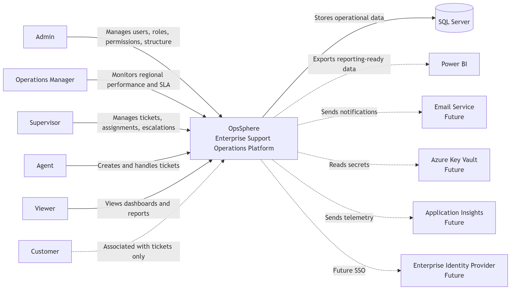
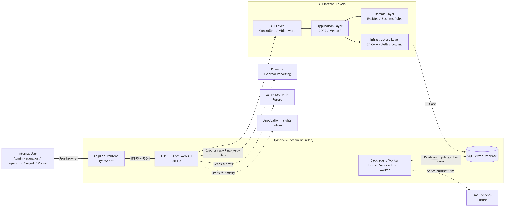
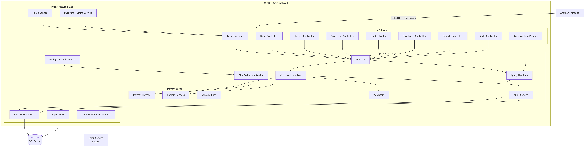
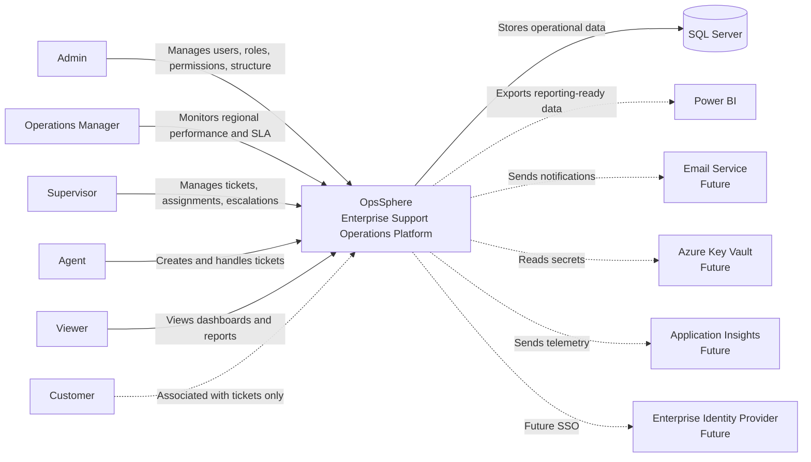
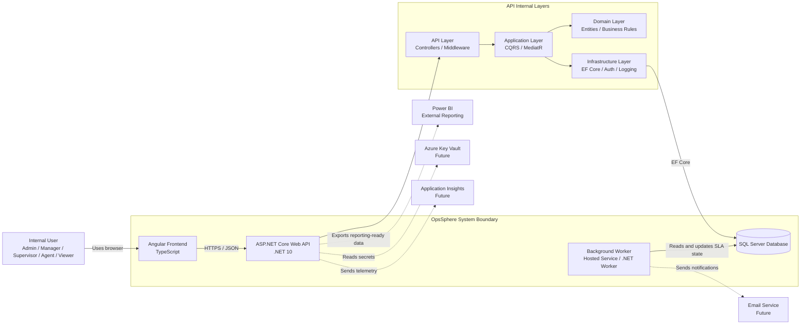
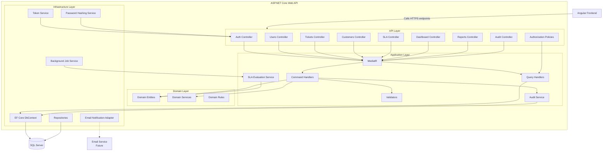

# C4 Architecture Diagrams

## Document Information

| Field | Value |
|---|---|
| Project | OpsSphere |
| Document | C4 Architecture Diagrams |
| File | `docs/12-c4-architecture.md` |
| Version | 1.0 |
| Status | Draft |
| Project Type | Enterprise Support Operations Platform |
| Architecture Model | C4 Model |
| Related Issue | #5 |

---

## 1. Purpose

This document defines the initial C4 architecture diagrams for OpsSphere.

The C4 Model is used to describe software architecture at different levels of detail:

1. **C1 - System Context**
2. **C2 - Container**
3. **C3 - Component**
4. **C4 - Code**

For OpsSphere, the initial architecture documentation focuses on:

- C1 System Context Diagram.
- C2 Container Diagram.
- C3 Component Diagram.

The C4 Code level is intentionally excluded from the initial documentation because the project has not entered implementation yet.

The goal is to explain the architecture clearly enough for portfolio review, implementation planning, and future technical decisions.

---

## 2. Diagram Folder Structure

C4 diagram images should be stored in the following folder:

```text
docs/
  diagrams/
    architecture/
      c4-system-context.png
      c4-container-diagram.png
      c4-component-diagram.png
```

The Markdown references in this document use relative paths from:

```text
docs/12-c4-architecture.md
```

Therefore, the image paths should be written as:

```text
diagrams/architecture/c4-system-context.png
diagrams/architecture/c4-container-diagram.png
diagrams/architecture/c4-component-diagram.png
```

---

## 3. C4 Model Scope for OpsSphere

## 3.1 Included Diagram Levels

| C4 Level | Name | Included | Purpose |
|---|---|---:|---|
| C1 | System Context | Yes | Show who uses OpsSphere and which external systems it interacts with. |
| C2 | Container | Yes | Show the major applications and data stores inside OpsSphere. |
| C3 | Component | Yes | Show the main backend components inside the ASP.NET Core Web API. |
| C4 | Code | No | Deferred until implementation produces concrete classes and modules. |

---

## 3.2 Diagram Audience

| Diagram | Main Audience |
|---|---|
| C1 System Context | Recruiters, technical interviewers, stakeholders, non-technical reviewers |
| C2 Container | Developers, architects, DevOps reviewers, technical interviewers |
| C3 Component | Backend developers, architects, reviewers evaluating Clean Architecture |

---

# 4. C1 - System Context Diagram

## 4.1 Purpose

The System Context Diagram shows OpsSphere as a single software system.

It explains:

- Who uses OpsSphere.
- What the system is responsible for.
- Which external systems exist around it.
- What is inside and outside the OpsSphere boundary.

At this level, OpsSphere is treated as a black box.

---

## 4.2 Diagram Reference



> Diagram placeholder: export the system context diagram as `c4-system-context.png` and store it in `docs/diagrams/architecture/`.

---

## 4.3 System Context Description

OpsSphere is an enterprise support operations platform used by internal operational users in a multinational BPO/contact center environment.

The system centralizes:

- Ticket management.
- Customer information.
- SLA tracking.
- Internal comments.
- Escalations.
- Audit history.
- Operational dashboards.
- Role-based access control.
- Reporting-ready operational data.

Customers are associated with tickets but do not directly access OpsSphere in the initial version.

---

## 4.4 People

| Person | Description | Relationship with OpsSphere |
|---|---|---|
| Admin | Configures users, roles, permissions, regions, countries, accounts, and campaigns. | Uses OpsSphere to manage platform structure and access. |
| Operations Manager | Oversees performance across assigned regions. | Uses OpsSphere to review dashboards, workload, SLA state, and operational trends. |
| Supervisor | Manages agents and tickets within assigned accounts or campaigns. | Uses OpsSphere to monitor workload, assign tickets, review SLA risk, and handle escalations. |
| Agent | Handles customer support tickets. | Uses OpsSphere to create, update, comment, escalate, resolve, and close tickets. |
| Viewer | Reviews operational information in read-only mode. | Uses OpsSphere to view tickets, dashboards, reports, and audit history. |
| Customer | Person or entity associated with a support case. | Does not directly access OpsSphere in the initial version. |

---

## 4.5 External Systems

| External System | Description | Relationship with OpsSphere |
|---|---|---|
| SQL Server | Primary relational database. | Stores users, tickets, customers, SLAs, comments, assignments, and audit records. |
| Power BI | External business intelligence platform. | May consume exported or reporting-ready data in future phases. |
| Email Service | External notification provider. | May send ticket, SLA, or escalation notifications in future phases. |
| Azure Key Vault | Secrets management service. | May store secrets and connection strings in Azure deployment. |
| Application Insights | Monitoring and telemetry service. | May collect logs, metrics, traces, and diagnostics in Azure deployment. |
| Enterprise Identity Provider | Corporate identity platform. | May support future SSO integration outside the MVP. |

---

## 4.6 System Context Relationships

```text
Admin
  → Uses OpsSphere to manage users, roles, permissions, and organizational structure.

Operations Manager
  → Uses OpsSphere to monitor regional performance, workload, SLA status, and reports.

Supervisor
  → Uses OpsSphere to manage tickets, assignments, escalations, and team workload.

Agent
  → Uses OpsSphere to create, update, comment, escalate, resolve, and close tickets.

Viewer
  → Uses OpsSphere to view operational data in read-only mode.

Customer
  → Is linked to tickets but does not directly access OpsSphere.

OpsSphere
  → Stores operational data in SQL Server.

OpsSphere
  → May expose reporting-ready data for Power BI.

OpsSphere
  → May send future notifications through an Email Service.

OpsSphere
  → May use Azure Key Vault for secrets in cloud deployment.

OpsSphere
  → May send telemetry to Application Insights in cloud deployment.

OpsSphere
  → May integrate with an Enterprise Identity Provider in a future SSO phase.
```

---

## 4.7 Suggested C1 Diagram Content

The C1 diagram should include:

```text
People:
  - Admin
  - Operations Manager
  - Supervisor
  - Agent
  - Viewer
  - Customer

Software System:
  - OpsSphere

External Systems:
  - SQL Server
  - Power BI
  - Email Service
  - Azure Key Vault
  - Application Insights
  - Enterprise Identity Provider
```

Recommended visual rule:

```text
Keep OpsSphere in the center.
Place users on the left.
Place external systems on the right.
Clearly mark future or optional integrations.
```

---

# 5. C2 - Container Diagram

## 5.1 Purpose

The Container Diagram shows the major deployable or executable parts of OpsSphere.

A container in the C4 Model does not mean Docker container only. It means an application, data store, service, or executable unit that has a clear responsibility.

For OpsSphere, the main containers are:

- Angular frontend.
- ASP.NET Core Web API.
- SQL Server database.
- Background worker.
- Email service.
- External reporting tool.
- Cloud observability and secrets services.

---

## 5.2 Diagram Reference



> Diagram placeholder: export the container diagram as `c4-container-diagram.png` and store it in `docs/diagrams/architecture/`.

---

## 5.3 Container Overview

| Container | Technology | Responsibility |
|---|---|---|
| Angular Frontend | Angular, TypeScript | Provides user interface for login, dashboards, tickets, customers, users, SLA, audit, and reports. |
| ASP.NET Core Web API | .NET 10, ASP.NET Core | Exposes REST API endpoints and coordinates application use cases. |
| Application Layer | .NET, MediatR | Handles commands, queries, validation, authorization coordination, and workflow orchestration. |
| Domain Layer | .NET class library | Contains entities, enums, value objects, domain rules, and business invariants. |
| Infrastructure Layer | EF Core, SQL Server integrations | Implements persistence, authentication services, logging, and technical integrations. |
| SQL Server Database | SQL Server | Stores operational data, configuration, tickets, customers, SLA state, comments, and audit history. |
| Background Worker | .NET Worker Service or hosted service | Handles scheduled SLA checks, future notification jobs, and background operational tasks. |
| Email Service | External provider | Sends future notifications for assignments, escalations, and SLA risk. |
| Power BI | External BI platform | Consumes structured data or exports for advanced reporting outside OpsSphere. |
| Azure Key Vault | Azure | Stores secrets and configuration values in cloud deployments. |
| Application Insights | Azure | Collects logs, metrics, traces, and telemetry in cloud deployments. |

---

## 5.4 Main Container Relationships

```text
User
  → Uses Angular Frontend through a browser.

Angular Frontend
  → Calls ASP.NET Core Web API using HTTPS and JSON.

ASP.NET Core Web API
  → Handles authentication, authorization, HTTP requests, and responses.

ASP.NET Core Web API
  → Sends commands and queries to the Application Layer.

Application Layer
  → Uses Domain Layer to enforce business rules.

Application Layer
  → Uses Infrastructure Layer interfaces for persistence, identity, audit, and external services.

Infrastructure Layer
  → Uses Entity Framework Core to read and write SQL Server data.

Background Worker
  → Reads active tickets and SLA state from SQL Server.

Background Worker
  → Updates SLA states and creates audit records when needed.

Background Worker
  → May call Email Service for notifications in future phases.

Power BI
  → May consume reporting-ready data or exports generated by OpsSphere.

ASP.NET Core Web API
  → May use Azure Key Vault for secrets in Azure deployment.

ASP.NET Core Web API
  → May send telemetry to Application Insights in Azure deployment.
```

---

## 5.5 Suggested C2 Diagram Content

The C2 diagram should include:

```text
Inside OpsSphere Boundary:
  - Angular Frontend
  - ASP.NET Core Web API
  - Background Worker
  - SQL Server Database

Inside ASP.NET Core Web API Boundary:
  - API Layer
  - Application Layer
  - Domain Layer
  - Infrastructure Layer

External Systems:
  - Email Service
  - Power BI
  - Azure Key Vault
  - Application Insights
```

Recommended visual rule:

```text
Show Angular on the left.
Show ASP.NET Core Web API in the center.
Show SQL Server on the right or bottom.
Show Background Worker near the API and database.
Show external systems outside the OpsSphere boundary.
```

---

## 5.6 Container Responsibilities

## Angular Frontend

The Angular frontend is responsible for:

- Login screen.
- Route protection.
- Role-aware navigation.
- Ticket queue views.
- Ticket detail views.
- Ticket creation forms.
- Customer management screens.
- User management screens.
- SLA dashboard views.
- Escalation views.
- Audit history views.
- Report or export screens.

The frontend may hide unauthorized actions based on role and scope, but backend authorization remains the source of truth.

---

## ASP.NET Core Web API

The ASP.NET Core Web API is responsible for:

- Exposing REST endpoints.
- Authenticating requests.
- Applying authorization policies.
- Validating request models.
- Calling application commands and queries.
- Returning response DTOs.
- Handling API errors consistently.
- Publishing logs and telemetry.
- Coordinating audit-sensitive workflows.

Controllers should remain thin.

Business rules should not be implemented directly inside controllers.

---

## Application Layer

The Application Layer is responsible for:

- Commands.
- Queries.
- Handlers.
- DTOs.
- Use case orchestration.
- Validation.
- Authorization coordination.
- Transaction boundaries.
- Audit coordination.
- Integration contracts.

Example commands:

```text
CreateTicketCommand
AssignTicketCommand
UpdateTicketStatusCommand
AddInternalCommentCommand
EscalateTicketCommand
ResolveTicketCommand
CloseTicketCommand
CreateUserCommand
AssignUserRoleCommand
AssignUserScopeCommand
```

Example queries:

```text
GetTicketByIdQuery
GetTicketListQuery
GetSlaDashboardQuery
GetAuditHistoryQuery
GetUserListQuery
GetCustomerHistoryQuery
```

---

## Domain Layer

The Domain Layer is responsible for:

- Core entities.
- Domain rules.
- Domain services.
- Enums.
- Value objects.
- Business invariants.

Examples of domain rules:

```text
A ticket must be resolved before it can be closed.
Closed tickets cannot be modified unless reopened by an authorized role.
An escalated ticket must include an escalation reason.
An internal comment cannot be empty.
A ticket must have a customer, account, campaign, priority, and status.
```

---

## Infrastructure Layer

The Infrastructure Layer is responsible for:

- Entity Framework Core DbContext.
- SQL Server configuration.
- Database migrations.
- Repository implementations if used.
- JWT token generation.
- Password hashing.
- Audit persistence.
- Logging implementation.
- Email provider integration in future phases.
- Cloud service integrations in future phases.

---

## SQL Server Database

The SQL Server database is responsible for storing:

- Users.
- Roles.
- Permissions.
- Regions.
- Countries.
- Accounts.
- Campaigns.
- Customers.
- Tickets.
- Ticket assignments.
- Ticket comments.
- Ticket escalations.
- SLA policies.
- SLA states.
- Audit logs.

---

## Background Worker

The background worker is responsible for background operational tasks.

Initial responsibilities may include:

- Checking active ticket SLA state.
- Marking tickets as at risk.
- Marking tickets as breached.
- Preserving completed SLA outcomes.
- Creating system-generated audit records.
- Triggering future notification events.

The background worker may be implemented as:

```text
ASP.NET Core Hosted Service
```

or as a separate:

```text
.NET Worker Service
```

The final deployment choice can be made during implementation.

---

# 6. C3 - Component Diagram

## 6.1 Purpose

The Component Diagram zooms into the ASP.NET Core Web API container.

It explains the main backend components and how they collaborate to support Clean Architecture, CQRS, persistence, authentication, authorization, and audit logging.

---

## 6.2 Diagram Reference



> Diagram placeholder: export the component diagram as `c4-component-diagram.png` and store it in `docs/diagrams/architecture/`.

---

## 6.3 Component Scope

The C3 diagram focuses on this container:

```text
ASP.NET Core Web API
```

The diagram should show the internal components that support:

- API endpoints.
- Authentication.
- Authorization.
- Application commands and queries.
- Domain rules.
- Persistence.
- Audit logging.
- Background jobs.
- External integrations.

---

## 6.4 Backend Components

| Component | Layer | Responsibility |
|---|---|---|
| Auth Controller | API | Handles login and token-related endpoints. |
| Users Controller | API | Handles user management endpoints. |
| Tickets Controller | API | Handles ticket lifecycle endpoints. |
| Customers Controller | API | Handles customer endpoints. |
| SLA Controller | API | Handles SLA dashboard and SLA state endpoints. |
| Dashboard Controller | API | Handles operational dashboard endpoints. |
| Reports Controller | API | Handles report and export endpoints. |
| Audit Controller | API | Handles audit history endpoints. |
| Authorization Policies | API / Application | Enforce role and scope-based access rules. |
| MediatR Pipeline Behaviors | Application | Handle validation, logging, authorization, transactions, and cross-cutting behavior. |
| Command Handlers | Application | Execute write workflows. |
| Query Handlers | Application | Execute read workflows. |
| Validators | Application | Validate request and use case inputs. |
| Domain Entities | Domain | Represent core business concepts and protect invariants. |
| Domain Services | Domain | Encapsulate domain rules that do not belong to one entity. |
| DbContext | Infrastructure | Coordinates EF Core persistence. |
| Repositories | Infrastructure | Encapsulate data access when needed. |
| Audit Service | Application / Infrastructure | Creates and persists audit records for critical actions. |
| Token Service | Infrastructure | Generates and validates JWT tokens. |
| Password Hashing Service | Infrastructure | Hashes and verifies passwords. |
| SLA Evaluation Service | Application / Domain | Calculates SLA state and identifies at-risk or breached tickets. |
| Background Job Service | Infrastructure | Runs scheduled operational tasks. |
| Email Notification Adapter | Infrastructure | Sends future notifications through an external email service. |

---

## 6.5 Component Relationships

```text
Angular Frontend
  → Calls API Controllers.

API Controllers
  → Validate HTTP request shape.
  → Delegate to MediatR.

MediatR
  → Sends commands and queries to handlers.

Command Handlers
  → Execute write use cases.
  → Load domain entities.
  → Apply domain rules.
  → Persist changes through DbContext or repositories.
  → Create audit records.

Query Handlers
  → Execute read use cases.
  → Apply role and scope filters.
  → Retrieve data through DbContext or query services.
  → Return DTOs.

Authorization Policies
  → Validate user role, permission, and operational scope.

Domain Entities
  → Protect core business invariants.

SLA Evaluation Service
  → Evaluates ticket SLA state.
  → Marks tickets as Within SLA, At Risk, Breached, or Completed.

Audit Service
  → Records critical business actions.

DbContext
  → Reads and writes SQL Server data.

Token Service
  → Generates JWT tokens for authenticated users.

Background Job Service
  → Runs scheduled SLA checks.
  → May trigger notification workflows.

Email Notification Adapter
  → Sends messages through an external email service in future phases.
```

---

## 6.6 Suggested C3 Diagram Content

The C3 diagram should include:

```text
External:
  - Angular Frontend
  - SQL Server Database
  - Email Service

Inside ASP.NET Core Web API:
  API Layer:
    - Auth Controller
    - Users Controller
    - Tickets Controller
    - Customers Controller
    - SLA Controller
    - Dashboard Controller
    - Reports Controller
    - Audit Controller
    - Authorization Policies

  Application Layer:
    - MediatR
    - Command Handlers
    - Query Handlers
    - Validators
    - Audit Service
    - SLA Evaluation Service

  Domain Layer:
    - Domain Entities
    - Domain Services
    - Domain Rules

  Infrastructure Layer:
    - DbContext
    - Repositories
    - Token Service
    - Password Hashing Service
    - Background Job Service
    - Email Notification Adapter
```

Recommended visual rule:

```text
Group components by Clean Architecture layer.
Show API controllers at the top.
Show Application components in the middle.
Show Domain components as the core.
Show Infrastructure components at the bottom.
Show SQL Server and Email Service outside the API boundary.
```

---

# 7. Clean Architecture Mapping

The C4 diagrams should support the Clean Architecture direction of OpsSphere.

## 7.1 Layer Mapping

| Clean Architecture Layer | C4 Representation | Main Elements |
|---|---|---|
| Presentation | Container / Component | Angular Frontend, API Controllers |
| Application | Component | Commands, Queries, Handlers, Validators, MediatR |
| Domain | Component | Entities, Value Objects, Enums, Domain Services, Domain Rules |
| Infrastructure | Container / Component | EF Core, SQL Server, Token Service, Email Adapter, Logging |

---

## 7.2 Dependency Direction

The intended dependency direction is:

```text
API
  → Application
    → Domain

Infrastructure
  → Application
  → Domain
```

The Domain Layer should not depend on:

- API.
- Angular.
- Entity Framework Core.
- SQL Server.
- Email service.
- Azure services.
- External infrastructure.

The Application Layer may define interfaces.

The Infrastructure Layer may implement those interfaces.

---

# 8. Diagram Creation Guidance

## 8.1 General Guidelines

When creating the diagrams:

- Keep each diagram focused on one level of abstraction.
- Avoid mixing too many technical details into the C1 diagram.
- Use technology names in the C2 diagram.
- Use Clean Architecture grouping in the C3 diagram.
- Use clear relationship labels.
- Mark future integrations clearly.
- Prefer readability over visual complexity.
- Do not include code-level class details in C1, C2, or C3.

---

## 8.2 Recommended Notation

Use simple boxes and arrows.

Suggested labels:

```text
Uses
Calls
Reads from
Writes to
Sends notifications through
Exports data to
Authenticates with
Stores data in
```

Suggested visual grouping:

```text
People
External Systems
OpsSphere Boundary
Frontend
Backend
Database
Future Integrations
```

---

## 8.3 Diagram Tool Options

The diagrams may be created using any of the following tools:

- Draw.io / diagrams.net.
- Mermaid.
- PlantUML with C4 extensions.
- Structurizr.
- Lucidchart.
- Visual Paradigm.

The final exported images should be committed as PNG files under:

```text
docs/diagrams/architecture/
```

---

# 9. Mermaid Drafts

The following Mermaid drafts can be used as starting points.

These are not required to be the final diagrams. They are included to make diagram creation easier.

---

## 9.1 C1 System Context Mermaid Draft



---

## 9.2 C2 Container Mermaid Draft



---

## 9.3 C3 Component Mermaid Draft



---

# 10. Diagram Validation Checklist

Use this checklist before committing the final diagram images.

## 10.1 C1 System Context Checklist

- OpsSphere appears as one central software system.
- Admin, Manager, Supervisor, Agent, Viewer, and Customer are shown.
- Customer is shown as linked to tickets but not as a direct system user.
- SQL Server is shown as the primary data store.
- Power BI is shown as external reporting, not part of the core platform.
- Future systems are clearly marked as future or optional.
- The diagram is understandable without implementation details.

---

## 10.2 C2 Container Checklist

- Angular Frontend is shown.
- ASP.NET Core Web API is shown.
- SQL Server Database is shown.
- Background Worker is shown.
- Email Service is shown as future or external.
- Power BI is shown as external.
- The main communication paths are clear.
- Technology choices are visible.
- The diagram does not include low-level classes.

---

## 10.3 C3 Component Checklist

- The diagram focuses on the ASP.NET Core Web API.
- Components are grouped by Clean Architecture layer.
- API Controllers are visible.
- MediatR, command handlers, and query handlers are visible.
- Domain entities and domain services are visible.
- EF Core DbContext and repositories are visible.
- Token service and password hashing service are visible.
- Audit service is visible.
- SLA evaluation service is visible.
- SQL Server appears as an external data store.
- Email service appears as a future external dependency.

---

# 11. Relationship to Other Documents

| Document | Relationship |
|---|---|
| `docs/11-architecture-overview.md` | Defines the architecture strategy that these diagrams visualize. |
| `docs/13-uml-diagrams.md` | Provides behavior and domain-level diagrams. |
| `docs/14-database-design.md` | Provides database tables, relationships, keys, indexes, and audit strategy. |
| `docs/15-api-design.md` | Provides endpoint-level API design. |
| `docs/16-security-and-permissions.md` | Provides authentication, authorization, roles, permissions, and audit-sensitive action rules. |

---

# 12. Document Summary

This document defines the initial C4 architecture diagrams for OpsSphere.

The C1 System Context Diagram explains who uses OpsSphere and which external systems surround it.

The C2 Container Diagram explains the major applications, services, and data stores that make up the system.

The C3 Component Diagram explains the internal backend structure of the ASP.NET Core Web API using Clean Architecture concepts.

The diagrams should be exported as PNG files and stored under:

```text
docs/diagrams/architecture/
```

Required diagram files:

```text
docs/diagrams/architecture/c4-system-context.png
docs/diagrams/architecture/c4-container-diagram.png
docs/diagrams/architecture/c4-component-diagram.png
```
