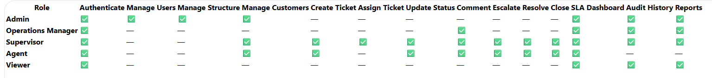
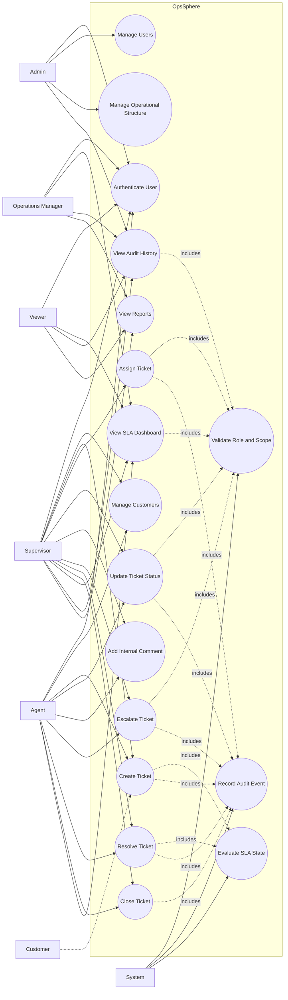
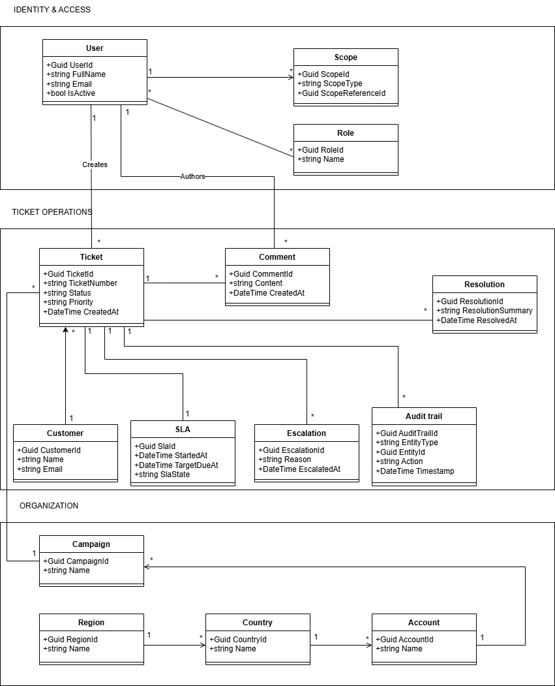
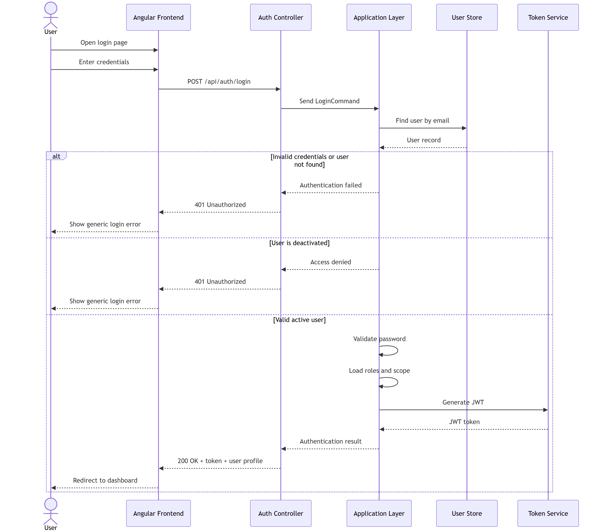
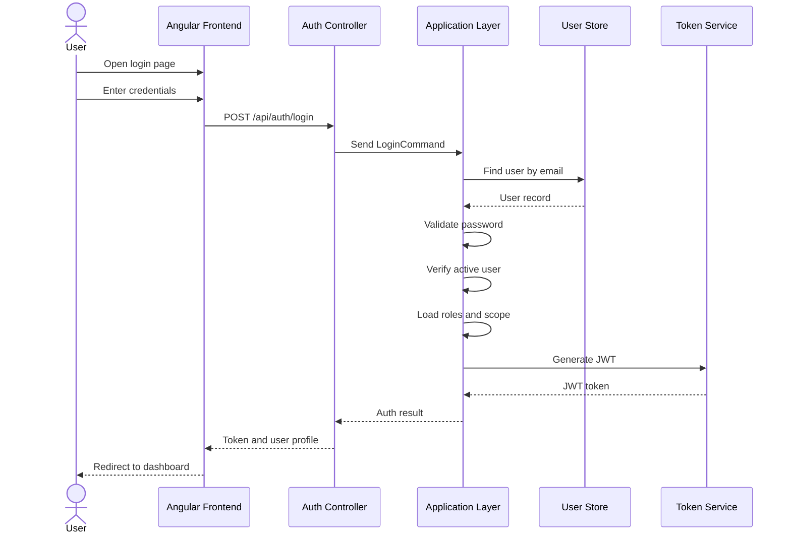
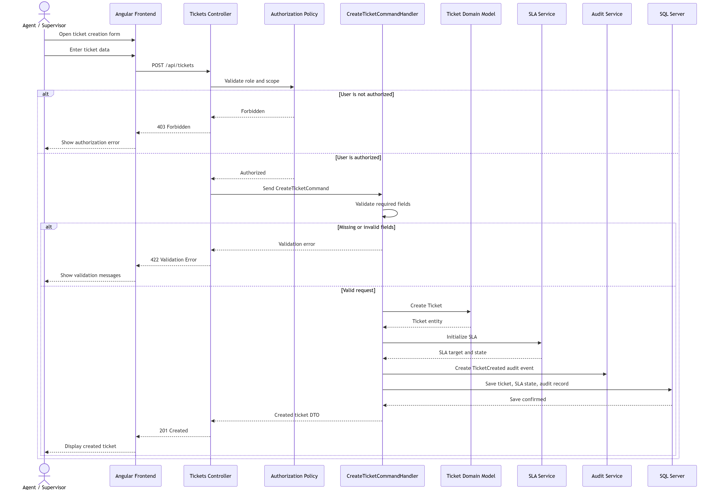
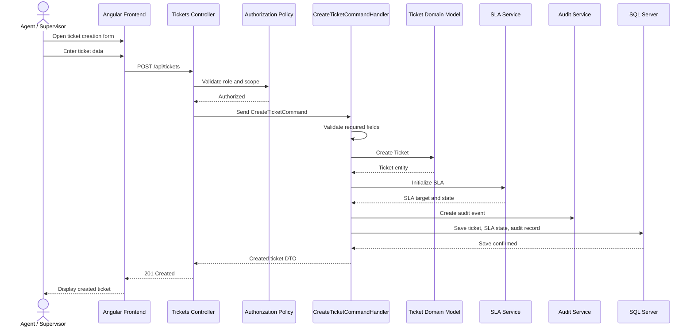
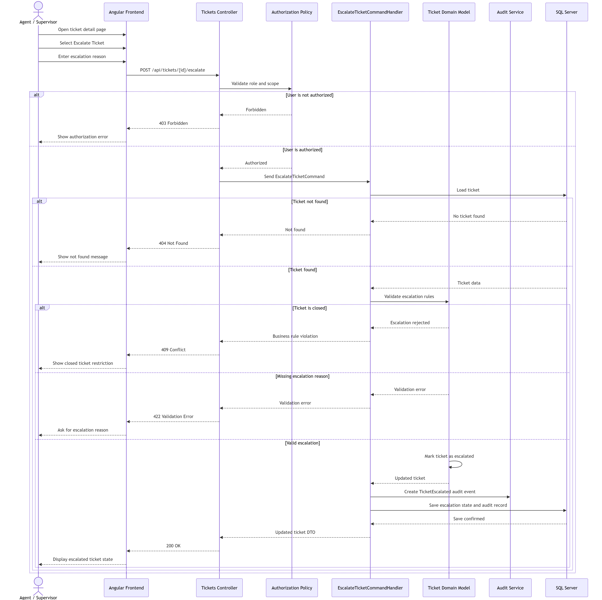
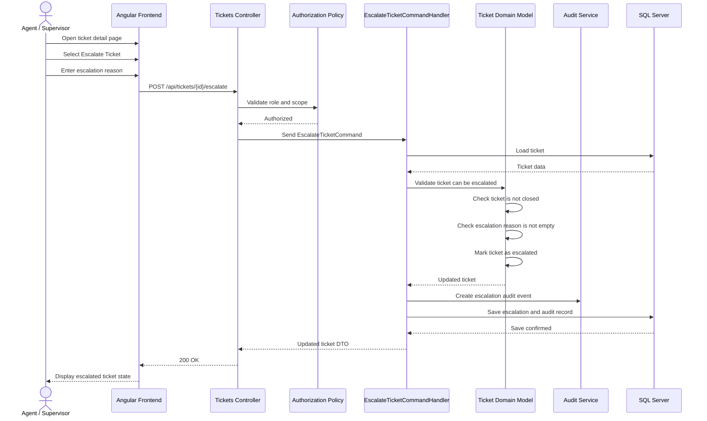

# UML Diagrams

## Document Information

| Field | Value |
|---|---|
| Project | OpsSphere |
| Document | UML Diagrams |
| File | `docs/13-uml-diagrams.md` |
| Version | 1.0 |
| Status | Draft |
| Project Type | Enterprise Support Operations Platform |
| Related Issue | #5 |

---

## 1. Purpose

This document defines the initial UML diagrams for OpsSphere.

UML diagrams are used to describe the system from different perspectives:

- How users interact with the system.
- How the core domain concepts relate to each other.
- How important technical workflows behave over time.

For OpsSphere, UML is introduced after the business context, requirements, use cases, business rules, domain model, and architecture overview have already been defined.

The purpose of this document is not to over-model the system before implementation. The purpose is to provide enough visual design guidance to support implementation planning, technical review, and portfolio presentation.

---

## 2. UML Diagram Scope

The initial UML diagram set includes:

| Diagram | Purpose | Status |
|---|---|---|
| Use Case Diagram | Shows the main actors and system use cases. | Planned |
| Domain / Class Diagram | Shows the core domain model and relationships. | Created |
| Sequence Diagram - Login | Shows the authentication flow. | Planned |
| Sequence Diagram - Create Ticket | Shows the ticket creation flow. | Planned |
| Sequence Diagram - Escalate Ticket | Shows the ticket escalation flow. | Planned |

The diagrams should remain high-level enough to guide implementation without locking the project into premature code-level details.

---

## 3. Diagram Folder Structure

UML diagrams should be stored under:

```text
docs/
  diagrams/
    uml/
      use-case-permission-matrix
      domain-class-diagram.png
      sequence-login.png
      sequence-create-ticket.png
      sequence-escalate-ticket.png
```

The Markdown references in this document use paths relative to:

```text
docs/13-uml-diagrams.md
```

Therefore, image references should use:

```text
diagrams/uml/use-case-permission-matrix.png
diagrams/uml/domain-class-diagram.png
diagrams/uml/sequence-login.png
diagrams/uml/sequence-create-ticket.png
diagrams/uml/sequence-escalate-ticket.png
```

---

# 4. UML Use Case Diagram

## 4.1 Purpose

The UML Use Case Diagram shows which actors interact with OpsSphere and what major goals they accomplish through the system.

This diagram should be based on the stakeholder map and use case specification.

It should focus on the main system behaviors rather than every possible screen or button.

---

## 4.2 Diagram Reference



> Diagram placeholder: export the use case diagram as `use-case-permission-matrix.png` and store it in `docs/diagrams/uml/`.

---

## 4.3 Actors

The initial use case diagram should include the following actors:

| Actor | Description |
|---|---|
| Admin | Manages users, roles, permissions, operational structure, and audit visibility. |
| Operations Manager | Reviews dashboards, SLA state, workload, escalations, and reports within assigned regions. |
| Supervisor | Assigns tickets, monitors agents, reviews SLA risk, manages escalations, and supervises operational execution. |
| Agent | Creates, updates, comments on, escalates, resolves, and closes tickets within assigned scope. |
| Viewer | Views tickets, dashboards, reports, and audit history in read-only mode. |
| Customer | Associated with tickets but does not directly access OpsSphere in the initial version. |
| System | Performs validation, authorization, SLA evaluation, and audit logging. |

---

## 4.4 Main Use Cases

The use case diagram should include the following initial use cases:

| Use Case | Main Actors |
|---|---|
| Authenticate User | Admin, Operations Manager, Supervisor, Agent, Viewer |
| Manage Users | Admin |
| Manage Operational Structure | Admin |
| Manage Customers | Admin, Supervisor, Agent |
| Create Ticket | Agent, Supervisor |
| Assign Ticket | Supervisor |
| Update Ticket Status | Agent, Supervisor |
| Add Internal Comment | Agent, Supervisor, Operations Manager |
| Escalate Ticket | Agent, Supervisor |
| Resolve Ticket | Agent, Supervisor |
| Close Ticket | Agent, Supervisor |
| View SLA Dashboard | Operations Manager, Supervisor, Agent, Viewer |
| View Audit History | Admin, Operations Manager, Supervisor, Viewer |
| View Reports | Operations Manager, Supervisor, Viewer |

---

## 4.5 Suggested Use Case Relationships

Suggested relationships:

```text
Authenticate User
  → Required before accessing protected use cases.

Create Ticket
  → Includes customer lookup or customer creation.
  → Includes SLA initialization.
  → Includes audit logging.

Assign Ticket
  → Includes assignment eligibility validation.
  → Includes audit logging.

Update Ticket Status
  → Includes workflow validation.
  → Includes audit logging.

Escalate Ticket
  → Includes escalation reason validation.
  → Includes supervisor visibility.
  → Includes audit logging.

Resolve Ticket
  → Includes SLA outcome preservation.
  → Includes audit logging.

Close Ticket
  → Includes resolution validation.
  → Includes audit logging.

View SLA Dashboard
  → Includes role and scope filtering.

View Audit History
  → Includes role and scope filtering.
```

---

## 4.6 Mermaid Draft

This Mermaid draft may be used as a starting point.



---

# 5. UML Domain / Class Diagram

## 5.1 Purpose

The Domain / Class Diagram shows the core domain concepts of OpsSphere and their relationships.

This diagram is based on the domain model and should represent the business language of the system.

It should focus on the most important domain concepts rather than every database table or implementation detail.

---

## 5.2 Diagram Reference



> Current diagram: `domain-class-diagram.png` already exists and should be treated as the primary domain/class diagram for the initial architecture documentation.

---

## 5.3 Main Domain Concepts

The domain/class diagram should include the following concepts:

| Concept | Description |
|---|---|
| User | Internal system user with role and operational scope. |
| Role | Defines high-level access responsibility such as Admin, Manager, Supervisor, Agent, or Viewer. |
| Permission | Defines specific allowed actions. |
| Scope | Defines operational visibility and access boundaries. |
| Region | Geographic operating area. |
| Country | National operation inside a region. |
| Account | Client account served by the BPO/contact center. |
| Campaign | Operational service or workload inside an account. |
| Customer | Person or entity associated with a support case. |
| Ticket | Main operational support case. |
| Comment | Internal collaboration note linked to a ticket. |
| SLA | Service level target and state associated with a ticket. |
| Escalation | Higher-level attention event for a ticket. |
| Queue | Operational grouping of tickets for agents or supervisors. |
| Resolution | Final handling outcome of a ticket. |
| Audit Trail | Traceability record for important actions. |
| Priority | Ticket urgency level. |
| Status | Ticket workflow state. |

---

## 5.4 Expected Relationships

The diagram should communicate these relationships:

```text
Region
  → contains Countries

Country
  → contains Accounts

Account
  → contains Campaigns

Campaign
  → contains Tickets

Customer
  → has Tickets

Ticket
  → belongs to Customer
  → belongs to Account
  → belongs to Campaign
  → has Priority
  → has Status
  → has SLA
  → has Comments
  → may have Escalations
  → may have Resolution
  → has Audit Trail records

User
  → has Role
  → has Scope
  → may be Agent, Supervisor, Manager, Admin, or Viewer

Supervisor
  → oversees Agents
  → oversees Tickets within scope

Agent
  → handles Tickets within scope

Audit Trail
  → records changes performed by User
  → references affected entity
```

---

## 5.5 Diagram Guidance

The existing PNG diagram should remain the official reference if it is visually clearer than an auto-generated diagram.

Use Mermaid or PlantUML only as optional support, not as a replacement for the hand-crafted diagram.

Recommended rule:

```text
The domain/class diagram should explain the business model, not the EF Core implementation.
```

Avoid adding implementation details such as:

```text
DbContext
Repositories
Controllers
DTOs
CommandHandlers
QueryHandlers
Migrations
```

Those belong to architecture or component diagrams, not the domain/class diagram.

---

# 6. Sequence Diagram - Login

## 6.1 Purpose

The Login sequence diagram shows how a user authenticates into OpsSphere.

It explains the interaction between:

- User.
- Angular frontend.
- Auth API.
- Application layer.
- User store.
- Token service.

---

## 6.2 Diagram Reference



> Diagram placeholder: export the login sequence diagram as `sequence-login.png` and store it in `docs/diagrams/uml/`.

---

## 6.3 Flow Description

```text
1. User opens the login page.
2. User enters credentials.
3. Angular frontend sends login request to Auth API.
4. Auth API sends authentication command to application layer.
5. Application layer validates user credentials.
6. Application layer verifies that the user is active.
7. Application layer loads user roles and scope.
8. Token service generates JWT.
9. API returns token and user profile.
10. Angular stores token and redirects user to the correct landing page.
```

---

## 6.4 Mermaid Draft



---

# 7. Sequence Diagram - Create Ticket

## 7.1 Purpose

The Create Ticket sequence diagram shows how an authorized user creates a support ticket.

It explains the interaction between:

- Agent or Supervisor.
- Angular frontend.
- Tickets API.
- Application command handler.
- Domain model.
- SLA service.
- Audit service.
- Database.

---

## 7.2 Diagram Reference



> Diagram placeholder: export the create ticket sequence diagram as `sequence-create-ticket.png` and store it in `docs/diagrams/uml/`.

---

## 7.3 Flow Description

```text
1. Agent or Supervisor opens the ticket creation form.
2. User enters ticket information.
3. Angular sends create ticket request.
4. Tickets API validates authentication.
5. Tickets API sends CreateTicketCommand.
6. Application handler validates role and operational scope.
7. Application handler validates required ticket fields.
8. Domain model creates the ticket.
9. SLA service assigns initial SLA target and state.
10. Audit service creates ticket creation audit event.
11. Database saves the ticket and audit record.
12. API returns created ticket response.
13. Angular displays the created ticket.
```

---

## 7.4 Mermaid Draft



---

# 8. Sequence Diagram - Escalate Ticket

## 8.1 Purpose

The Escalate Ticket sequence diagram shows how an authorized user escalates a ticket that requires higher-level attention.

It explains the interaction between:

- Agent or Supervisor.
- Angular frontend.
- Tickets API.
- Authorization policy.
- Escalation command handler.
- Ticket domain model.
- Audit service.
- Database.

---

## 8.2 Diagram Reference



> Diagram placeholder: export the escalate ticket sequence diagram as `sequence-escalate-ticket.png` and store it in `docs/diagrams/uml/`.

---

## 8.3 Flow Description

```text
1. Agent or Supervisor opens the ticket detail page.
2. User selects Escalate Ticket.
3. User enters escalation reason.
4. Angular sends escalation request.
5. Tickets API validates authentication.
6. Authorization policy validates role and operational scope.
7. Application handler loads the ticket.
8. Domain model verifies that the ticket is not closed.
9. Domain model verifies that escalation reason is provided.
10. Domain model marks ticket as escalated.
11. Audit service creates escalation audit event.
12. Database saves escalation state and audit record.
13. API returns updated ticket response.
14. Angular displays escalated ticket state.
```

---

## 8.4 Mermaid Draft



---

# 9. Sequence Diagram - Login Failure Scenarios

## 9.1 Purpose

Login failure scenarios should be considered even if they are not shown in the main diagram.

---

## 9.2 Failure Cases

| Failure Case | Expected System Behavior |
|---|---|
| Invalid credentials | Reject login and show generic error. |
| Deactivated user | Reject login and prevent token generation. |
| Missing role | Reject access to protected modules. |
| Expired token | Reject protected API request and require login again. |

---

# 10. Sequence Diagram - Create Ticket Failure Scenarios

## 10.1 Failure Cases

| Failure Case | Expected System Behavior |
|---|---|
| Missing required fields | Reject request with validation errors. |
| Unauthorized account or campaign | Reject ticket creation. |
| Invalid customer | Reject request or require valid customer selection. |
| Missing priority | Reject ticket creation. |
| Database failure | Return controlled server error and do not create partial ticket state. |

---

# 11. Sequence Diagram - Escalate Ticket Failure Scenarios

## 11.1 Failure Cases

| Failure Case | Expected System Behavior |
|---|---|
| Missing escalation reason | Reject escalation request. |
| Closed ticket | Reject escalation request. |
| Unauthorized user | Reject escalation request. |
| Ticket outside user scope | Reject escalation request. |
| Ticket not found | Return not found response. |

---

# 12. UML Modeling Guidelines

## 12.1 Use Case Diagram Guidelines

The use case diagram should:

- Show main actors.
- Show high-level system goals.
- Avoid showing every UI screen.
- Avoid implementation classes.
- Keep customer as an external related actor, not a direct system user.
- Show system-supported behavior, not internal code details.

---

## 12.2 Class Diagram Guidelines

The class diagram should:

- Represent domain concepts.
- Use business language.
- Show important relationships and multiplicity when useful.
- Avoid database-only tables unless they represent domain concepts.
- Avoid DTOs, controllers, handlers, repositories, and infrastructure classes.
- Stay aligned with the domain model document.

---

## 12.3 Sequence Diagram Guidelines

Sequence diagrams should:

- Focus on important runtime flows.
- Show actor, frontend, API, application, domain, infrastructure, and database participants.
- Include authorization and audit where relevant.
- Avoid showing every method call.
- Prefer clarity over excessive technical detail.
- Represent the expected implementation direction without freezing exact class names too early.

---

# 13. Required Diagram Files

The initial required UML diagram files are:

```text
docs/diagrams/uml/use-case-permission-matrix.png
docs/diagrams/uml/domain-class-diagram.png
docs/diagrams/uml/sequence-login.png
docs/diagrams/uml/sequence-create-ticket.png
docs/diagrams/uml/sequence-escalate-ticket.png
```

Current status:

| Diagram File | Status |
|---|---|
| `docs/diagrams/uml/use-case-permission-matrix.png` | Created |
| `docs/diagrams/uml/domain-class-diagram.png` | Created |
| `docs/diagrams/uml/sequence-login.png` | Created |
| `docs/diagrams/uml/sequence-create-ticket.png` | Created |
| `docs/diagrams/uml/sequence-escalate-ticket.png` | Created |

---

# 14. Relationship to Other Documents

| Document | Relationship |
|---|---|
| `docs/04-stakeholders.md` | Defines the actors used in the UML Use Case Diagram. |
| `docs/07-use-cases.md` | Defines the use cases represented in the UML Use Case Diagram. |
| `docs/10-domain-model.md` | Defines the domain concepts represented in the UML Domain/Class Diagram. |
| `docs/11-architecture-overview.md` | Defines the architecture direction that informs sequence diagram participants. |
| `docs/12-c4-architecture.md` | Defines system, container, and component views that complement UML diagrams. |
| `docs/14-database-design.md` | Defines database structures related to the domain model. |
| `docs/15-api-design.md` | Defines API endpoints used by sequence diagrams. |
| `docs/16-security-and-permissions.md` | Defines authorization and audit rules referenced by the diagrams. |

---

# 15. Document Summary

This document defines the initial UML diagram set for OpsSphere.

The UML Use Case Diagram explains which actors interact with the system and which high-level goals they accomplish.

The UML Domain/Class Diagram explains the core business concepts and relationships of the platform. The existing `domain-class-diagram.png` is treated as the official initial domain/class diagram.

The UML Sequence Diagrams explain important technical flows for login, ticket creation, and ticket escalation.

Together, these diagrams complement the C4 architecture diagrams by showing user interaction, domain structure, and runtime behavior in more detail.